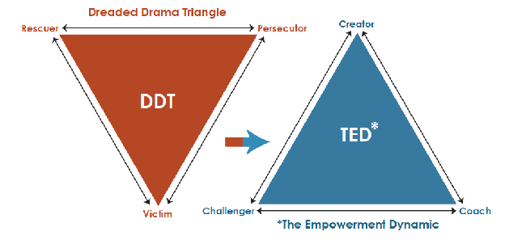

# Sąmoningumo biblioteka

„Sąmoningumo biblioteka" – tai ne nauja, mano paties sukurta gyvenimo filosofija, o skirtingų autorių, knygų ir idėjų visuma: surinkta, susisteminta ir sujungta ieškant, kaip jos viena kitą papildo. Šias idėjas jungia viena ašis – perėjimas iš Aukos į Kūrėjo poziciją. Tikslas – ne pateikti vieną „teisingą" atsakymą, kaip gyventi, o padėti kiekvienam atrasti principus, įrankius ir mąstymo būdus, iš kurių galima sąmoningai susikurti savo gyvenimo filosofiją.

Visą šią idėją galima nusakyti vienu sakiniu:

*„Aš negaliu visada pasirinkti to, kas man nutinka, tačiau galiu mokytis pasirinkti, ką su tuo darau, kaip reaguoju."*

## 1. Dvi gyvenimo orientacijos

1968 metais psichiatras Stephenas B. Karpmanas sukūrė vadinamojo Dramos trikampio (angl. *Dreaded Drama Triangle*) modelį – žemėlapį, padedantį atpažinti, kaip konfliktų metu tarp žmonių gali užsimegzti destruktyvi sąveika.

### Aukos trikampis

Aukos orientacijoje žmogus į gyvenimą pirmiausia žvelgia per **problemą**.

Trikampį sudaro trys vaidmenys:

* **Auka** – „aš negaliu", „man taip nutiko", „nieko negaliu pakeisti";
* **Persekiotojas** – žmogus, aplinkybė ar sąlyga, kuriai priskiriama mano bejėgiškumo priežastis;
* **Gelbėtojas** – tas, kuris turi mane išgelbėti, išspręsti mano problemą ar padaryti už mane tai, ko pats nesu pasiruošęs padaryti.

Šie vaidmenys palaiko vienas kitą. Auka suteikia Persekiotojui galią, o Gelbėtojas – priklausomybę. Žmogus gali nuolat keisti vaidmenis, tačiau išlieka tame pačiame trikampyje.

Svarbu atskirti **tapimą auka** nuo **gyvenimo Aukos pozicijoje**. Mes visi patiriame skausmą, neteisybę, praradimus ir situacijas, kuriose objektyviai nuo mūsų mažai kas priklauso. Tačiau tai nebūtinai reiškia, kad turime susitapatinti su bejėgiškumu.

### Kūrėjo trikampis

Šiam trikampiui atsvarą pasiūlė Davidas Emeraldas knygoje *The Power of TED\** (*The Empowerment Dynamic*). Kūrėjo orientacija prasideda nuo klausimo:

*„Ką aš galiu sukurti iš to, ką turiu dabar?"*

Čia atsiranda trys nauji vaidmenys:

* **Kūrėjas** – prisiima atsakomybę už savo pasirinkimus ir rezultatų kūrimą;
* **Iššūkio metėjas** – tai, kas trukdo ar priešinasi, tampa ne priežastimi jaustis bejėgiu, o galimybe mokytis, augti ir keisti veiksmus;
* **Treneris / koučeris** – vietoj gelbėjimo padeda žmogui pačiam atrasti savo sprendimus.

Todėl pagrindinis pokytis yra ne tas, kad **problemų nebelieka**. Problemos lieka. Pasikeičia mūsų santykis su jomis:
**Auka reaguoja į aplinkybes. Kūrėjas iš aplinkybių kuria kitą žingsnį.**

## 2. Kūrėjas turi du požiūrio taškus

Kūrėjo pozicija veikia dviem kryptimis: „**į vidų**" ir „**į išorę**".

### Vidinis požiūris – kaip aš priimu pasaulį

Kai susiduriu su kitu žmogumi ar aplinkybe, galiu pasirinkti, kaip tai interpretuoti. **Persekiotoją** galiu matyti kaip **nekonstruktyvų Iššūkio metėją**.

Tai nereiškia toleruoti žalingą elgesį. Tai reiškia nesuteikti kitam žmogui galios apibrėžti mano būseną.

Vietoj: „*Jis mane verčia taip jaustis."*
Atsiranda: „*Tai, ką jis daro, yra iššūkis. Ką galiu pasirinkti daryti aš?*"

**Gelbėtojo** atveju Kūrėjas neprivalo priimti pagalbos vien todėl, kad ji siūloma.

Galima pasakyti: „*Ačiū, vertinu tavo norą padėti. Patarimą išgirdau, tačiau sprendimą noriu priimti pats ir už jį prisiimti atsakomybę.*"
Tai nėra atstūmimas. Tai **atsakomybės išsaugojimas**.

### Išorinis požiūris – kaip aš veikiu kitus

Kūrėjo pozicija keičia ir tai, **kaip pats elgiuosi su kitais**. Užuot tapęs Persekiotoju, galiu būti **konstruktyviu Iššūkio metėju**:

* sakyti tiesą, bet nežeminti;
* kelti aukštus standartus, bet nevaldyti;
* parodyti problemą, bet neklijuoti žmogui etiketės;
* skatinti augimą, o ne sukelti baimę.

Užuot tapęs Gelbėtoju, tampu **Treneriu / koučeriu**.

Užuot sprendęs už kitą: „*Aš žinau, ką tau reikia daryti*", klausiu:
„*Ko tu iš tikrųjų nori?*"
„*Ką jau bandei?*"
„*Kas tau trukdo?*"
„*Kokias galimybes matai?*"
„*Koks būtų tavo kitas mažas žingsnis?*"

**Gelbėtojas atima iš žmogaus dalį atsakomybės. Treneris padeda žmogui atrasti savo galią.**

## 3. Nesmurtinis bendravimas – Kūrėjo kalba

Marshall B. Rosenberg **Nesmurtinis bendravimas (NVC)** papildo Kūrėjo modelį labai praktišku įrankiu: **kaip savo vidinę poziciją paversti konstruktyvia išorine komunikacija.**

Pagrindinė NVC struktūra:

**1. Stebėjimas** – apibūdinu tai, kas faktiškai įvyko, nepridėdamas vertinimo.
*„Šią savaitę tris kartus susitarėme, kad indai bus sutvarkyti, tačiau jie liko neplauti."*

**2. Jausmas** – įvardiju, ką tai manyje sukelia.
*„Dėl to jaučiuosi pavargęs ir susierzinęs."*

**3. Poreikis** – atpažįstu, koks mano poreikis slypi už jausmo.
*„Man svarbu tvarka ir tai, kad namų darbus dalytumėmės atsakingai."*

**4. Prašymas** – aiškiai paprašau konkretaus veiksmo.
*„Ar galėtum nuo šiol po vakarienės sutvarkyti indus?"*

Tačiau čia yra vienas esminis Kūrėjo principas: **prašymas nėra reikalavimas.** Tikras prašymas turi galėti priimti ir **„taip"**, ir **„ne"**. Jeigu „ne" man nepriimtinas, greičiausiai tai buvo ne prašymas, o reikalavimas.

Kūrėjas, gavęs „ne", negrįžta į Aukos poziciją: *„Aš paprašiau, o tu nepadarei, vadinasi, manimi nesirūpini."*
Jis ieško kito kelio: *„Gerai. Mano poreikis vis dar egzistuoja. Kokį kitą sprendimą galiu sukurti?"*
Todėl **nesėkmingas būdas nėra nesėkmingas gyvenimas. Tai informacija apie pasirinktą būdą.**

## 4. Meilė sau – kūrimo pagrindas

Tačiau prieš kalbant su kitais iš Kūrėjo pozicijos, verta grįžti dar giliau – į santykį su savimi. Don Miguel Ruiz **The Mastery of Love** papildo šį modelį kitu svarbiu aspektu: **santykiu su savimi ir savo vidinėmis žaizdomis.**

Galima įsivaizduoti, kad kiekvienas žmogus turi vidinę „odos ligą" – tam tikras senas žaizdas, dėl kurių tampame itin jautrūs tam tikriems kitų žmonių veiksmams.

Kai kas nors paliečia tą vietą, skauda ne tik dėl dabartinės situacijos. Skausmą gali sustiprinti tai, kas buvo patirta anksčiau.

Kūrėjo kelias nėra apsimesti, kad žaizdos neegzistuoja. Jis jas **atveria, pamato, išvalo ir gydo**.

Kaip chirurgas negali išgydyti seniai pūliuojančios žaizdos jos neatvėręs, taip ir žmogus dažnai negali išgydyti savo vidinių žaizdų jų nepripažinęs.

Išgijusi žaizda gali palikti **randą**. Randas primena: *„Taip, tai įvyko."* Tačiau nebesako: *„Man vis dar skauda."* Tai yra svarbus skirtumas tarp **patirties pripažinimo** ir **tapatinimosi su Auka**.

Aš galiu pripažinti, kas man nutiko, pripažinti savo skausmą, išmokti iš patirties ir kartu pasakyti: *„Tai yra mano istorijos dalis, bet tai nėra mano tapatybė ir neprivalo būti mano ateitis."*

## 5. Davimas iš trūkumo ir davimas iš gausos

Tas pats principas galioja santykiams. Jeigu duodu kitam žmogui todėl, kad slapta tikiuosi gauti kažką mainais, tačiau to negaunu, atsiranda nuoskauda: *„Po visko, ką dėl tavęs padariau..."* Tai dažnai yra **davimas iš trūkumo**.

Toks „davimas" gali tapti paslėptu sandoriu arba **Gelbėtojo vaidmeniu**. Jeigu negaliu duoti be lūkesčio, turiu du pasirinkimus:

1. **neduoti**, arba
2. **aiškiai susitarti**, ko tikiuosi mainais.

Kita alternatyva – **davimas iš gausos**.

Tai panašu į virtuvę, kurioje turiu pakankamai ingredientų pasigaminti tai, ko noriu. Aš gaminu ne todėl, kad kitas žmogus privalės man pagaminti kažką atgal, o todėl, kad **turiu kuo pasidalinti ir noriu tuo dalintis**.

Tuomet davimas tampa ne auka, o pasirinkimu.

*Auka duoda tam, kad gautų.*
*Kūrėjas duoda todėl, kad gali ir nori duoti.*

## 6. Ribos – kur baigiasi mano kūrimas

Tačiau noras duoti iš gausos neturėtų virsti pareiga duoti be ribų. Kūrėjas nėra žmogus, kuris prisiima atsakomybę už viską. Priešingai – viena svarbiausių Kūrėjo savybių yra gebėjimas atskirti:

**Kas yra mano atsakomybė?**
**Kas yra kito žmogaus atsakomybė?**
**Ko aš negaliu kontroliuoti?**

Jeigu nuolat sprendžiu kitų žmonių problemas, nors jie patys galėtų jas spręsti, tampu Gelbėtoju.

Jeigu leidžiu kitiems spręsti mano problemas už mane, tampu Auka. Todėl sveikos ribos nėra egoizmas. Jos leidžia pasakyti: *„Tai yra mano dalis. Aš ją prisiimu."* ir kartu: *„Tai yra tavo dalis. Aš galiu tave palaikyti, bet negaliu jos nugyventi už tave."*

**Atsargiai** – tarp sveikų ribų brėžimo ir manipuliacijos yra labai plona riba. Siekiant įgyvendinti savo tikslus ir kurti sau geresnį gyvenimą, svarbu nepamiršti ir aplinkinių: tavo pasirinkimai neturėtų būti nukreipti prieš kitus. Idealiu atveju tavo kuriama gerovė ne tik nekenkia aplinkai, bet ir leidžia joje esantiems žmonėms kartu patirti naudą.

## 7. Kūrėjo principas – nebijoti klysti

Net ir sąžiningai laikantis savo ribų, klaidų nepavyks išvengti – ir tai natūralu.

### Nepamėginti – dviguba nesėkmė

Kartais atsiranda proga, tačiau ją lydi baimė, išankstinės nuostatos ar kitų žmonių nuomonė, kad tai „nesąmonė". Jeigu tokiu atveju nepabandome, tai jau dviguba nesėkmė: nesužinome nei rezultato, nei to, ko būtume iš bandymo pasimokę.

Palyginimui – jeigu pabandome ir nepasiseka, tai tik viena nesėkmė. Galbūt nebuvome pakankamai pasiruošę, pritrūko patirties, aplinkybės buvo netinkamos. Tačiau bent jau žinome, ko išmokome, kokios patirties ir ryšių įgijome. Svarbu suprasti: imantis nežinomybės, mūsų nelaukia pasirinkimas tarp „pavyks" ir „nepavyks" – mūsų laukia pasirinkimas tarp „pavyks" ir „pasimokysiu".

Įsivaizduokime, kad pabandę būtume sulaukę sėkmės – nesvarbu net, koks tiksliai būtų buvęs rezultatas. Mes niekada nesužinosime, ko dėl to netekome, ko galėjome išmokti, kokios patirties įgyti. Būtent tai ir yra ta antroji, tylioji nesėkmės pusė.

Dažniausiai bijome ne pačios nesėkmės, o su ja susijusio skausmo – ir ši baimė iš anksto atrodo kur kas didesnė nei nežinomybės keliamas nerimas ar apgailestavimo jausmas. Todėl atrodo logiška: jei nepamėginsi, apsisaugosi nuo tiesioginio skausmo, kurio taip bijai. Bet tai apgaulingas saugumas – nebandymas neišgelbsti nuo skausmo, o tik pakeičia jį kitu: vėliau, dažnai ilgam, kamuoja mintis „O kas būtų, jeigu būčiau pamėginęs?" Čia ir slypi dviguba nesėkmė – nepatiri to, ko siekei, ir niekada nesulauki atsakymo, kuris leistų nurimti. Tuo tarpu pamėginus ir patyrus nesėkmę, klausimų nebelieka – atsakymą jau žinai ir gali judėti toliau. Kuo dažniau susiduri su nesėkme ir ją išgyveni, tuo labiau auga patirtis ir įgūdžiai.

### Klaida – ne nuosprendis, o pamoka

Kūrėjo kelias nėra garantija, kad visada priimsiu teisingą sprendimą. Tai būtų neįmanoma. Kūrėjas supranta, kad kiekvienas pasirinkimas gali duoti vieną iš dviejų dalykų: **rezultatą arba pamoką.** Todėl klaida nebūtinai reiškia: *„Aš nesugebu."* Ji gali reikšti: *„Šis būdas nesuveikė. Ką dabar žinau, ko anksčiau nežinojau?"*

Tai ypač svarbu tada, kai dar tik ugdoma savivertė. Pradėjęs kurti žmogus gali norėti iš kitų patvirtinimo:
*„Ar mano idėja gera?"*
*„Ar aš teisingai galvoju?"*
*„Ar tikrai taip galima?"*

Tačiau kitas žmogus neturi mano patirties. Jis turi **savo** patirtį, baimes, įsitikinimus ir galbūt pats gyvena Aukos trikampyje. Todėl jo neigiamas atsakymas nebūtinai reiškia, kad mano vizija bloga.

Kūrėjas mokosi klausti ne: *„Ar mano idėja gera?"* o:
*„Ką konkrečiai tu matai šioje dalyje?"*
*„Kokia, tavo manymu, būtų didžiausia rizika?"*
*„Ką aš galbūt praleidau?"*
*„Kokius alternatyvius sprendimus matai?"*

Tuomet **kitų žmonių nuomonė tampa informacija, o ne leidimu veikti.**

### Triukas: „treniruotis" vietoje „bandyti"

Vienas paprastas, bet veiksmingas būdas sumažinti nesėkmės baimę – pakeisti žodį, kuriuo įvardijame veiksmą. „Pabandysiu" (angl. *try*) ir „treniruojuosi" (angl. *train*) skamba panašiai, bet sukuria visiškai skirtingą santykį su klaidomis. Kai sakome „pabandysiu", veiksmas suvokiamas kaip vienkartinis įvykis su dviem galimomis baigtimis – pavyks arba nepavyks. Todėl po nesėkmės dažnai nusvyra rankos: jei „bandymas" nepavyko, atrodo, kad viskas baigta.

Kai sakome „treniruojuosi", požiūris pasikeičia – treniruotėje klaidos ir nesėkmės nėra pabaiga, o natūrali proceso dalis: būtent iš jų mokomasi ir tobulėjama. Taigi pervadinus veiksmą treniruote, tas pats bandymas nustoja būti sprendžiamuoju „pavyks / nepavyks" momentu ir tampa vienu žingsniu ilgesniame kelyje – todėl nesėkmę ištverti ir po jos tęsti tampa daug lengviau.

### Maži žingsniai į priekį

James Clear pateikė puikų pavyzdį apie ledo kubelį. Įsivaizduokime kambarį, kuriame temperatūra pamažu kyla nuo −10 laipsnio: −9, −8, −7... Kiekvienas laipsnis atskirai lyg ir nieko nekeičia – ledo kubelis lieka toks pat, jokio matomo pokyčio nevyksta. Bet pasiekus +1 laipsnį, kubelis staiga pradeda tirpti. Svarbu suprasti: tirpimą sukėlė ne paskutinis laipsnis pats savaime, o visi ankstesnieji – jie sukaupė būtiną kritinę masę, be kurios paskutinis žingsnis nebūtų turėjęs jokios reikšmės.

Lygiai taip pat veikia ir treniruotė. Vienas „bandymas" – tai vienas laipsnis iš daugelio. Jei po pirmo ar antro karto rezultato nematyti, tai dar nereiškia, kad kryptis neteisinga – tiesiog kritinė patirties masė dar nesusiformavusi. Norimam tikslui pasiekti dažnai reikia ne vieno pabandymo, o daugybės treniruočių, kurių kiekviena, net ir baigdamasi nesėkme, prisideda prie tos pačios besikaupiančios patirties.

Šią mintį puikiai iliustruoja ir žinoma priemonės WD-40 pavadinimo istorija: pati gamintojo bendrovė pasakoja, kad veikianti formulė buvo rasta būtent 40-ame bandyme – iš čia ir pavadinimas, kilęs nuo angliško „Water Displacement, 40th attempt" (liet. „vandens išstūmimas, 40-as bandymas"). Vadinasi, prieš tai buvę 39 nepavykę bandymai nebuvo tušti – kiekvienas jų buvo dar vienas laipsnis, artinantis prie tos pačios kritinės ribos, po kurios sprendimas pagaliau „ištirpo".

Drąsa nėra tuomet, kai turime aiškų matymą – tai gebėjimas judėti pirmyn, kai viskas neaišku.

## 8. Praeitis, dabartis, ateitis – kur telkiame galią

Ir judėti pirmyn galime tik iš vienos vietos – iš dabarties.

*„Jei manai, kad kažkas sugriovė tavo gyvenimą – tuomet esi teisus. Tai buvai tu."*
(angl. „If you think someone ruined your life, you're right. It's you." – laisva, šiuolaikinė Friedricho Nietzsches minties interpretacija)

Nuolatinis grįžimas mintimis prie praeities skausmų kartais vadinamas depresija, o nuolatinis nerimavimas dėl ateities – nerimu. Tai, žinoma, didelis supaprastinimas – tikrosios šių būsenų priežastys būna daug sudėtingesnės – tačiau abu šiuos požymius vienija tas pats bruožas: dėmesys nukreiptas ne į dabartį, o į laiką, kurio jau nebekontroliuojame arba dar neturime. Todėl toks svarbus gebėjimas būti čia ir dabar: įsižeminti, sustoti ir įvertinti tai, ką jau turime.

Kai manome, kad už tai, kur šiandien esame, atsakingi kiti – aplinkybės, žmonės, praeities įvykiai – tuo pačiu momentu atiduodame jiems galią valdyti mus pačius. O iš tikrųjų esame savo gyvenimo kūrėjai, turintys galią jį formuoti.

Šiame taške atsidūrėme dėl praeityje priimtų sprendimų – savų, o ne svetimų. Todėl verta padėkoti sau už tai, kur esame šiandien, ir už tai, ko pakeliui išmokome, net jei kelias nebuvo lengvas. Niekas kitas negali mylėti tavęs labiau, nei gali tu pats. Kai priimame, kad būtent mūsų pačių pasirinkimai atvedė mus čia, atsiranda laisvė sąmoningai išsikelti tikslus, kur norime nukeliauti toliau. Belieka susidėlioti planą ir kasdien žengti nors po vieną mažą žingsnį jo link.

## 9. Žaisk tomis kortomis, kurias gavai

Tam, kad toks planas būtų realistiškas, verta žinoti, ką iš tikrųjų galime kontroliuoti kelyje į tikslą. Geras gyvenimas prasideda nuo gebėjimo atskirti tris dalykus:

* ką galime visiškai kontroliuoti,
* ko negalime paveikti visiškai,
* ir kam galime daryti tik dalinę įtaką.

Šios minties šaknys – Epikteto suformuluota kontrolės dichotomija: viskas, kas mums nutinka, priklauso arba mūsų valdžiai, arba ne, trečio varianto nėra. Vėliau Williamas B. Irvine'as knygoje *A Guide to the Good Life: The Ancient Art of Stoic Joy* šią dichotomiją išplėtojo į trichotomiją – jis pastebėjo, kad kategorija „nepriklauso nuo mūsų" iš tikrųjų skyla į dvi dalis: tai, kas nepriklauso visiškai (pvz., ar rytoj lis), ir tai, kas priklauso iš dalies (pvz., ar laimėsime varžybas). Būtent ši trečioji, tarpinė kategorija ir yra įdomiausia, nes apima didžiąją dalį mūsų kasdienio gyvenimo.

> **Kas yra dichotomija?** Paprastai tariant – padalijimas į dvi dalis, tarp kurių nėra jokio vidurio. Pavyzdys iš kasdienybės: paprastas šviesos jungiklis – jis arba įjungtas, arba išjungtas, trečio varianto nėra.

> **Kas yra trichotomija?** Padalijimas į tris dalis, kai atsiranda ir „vidurinis" variantas. Grįžkime prie šviesos – įsivaizduokime lemputę su reguliatoriumi (dimeriu): ji gali būti visiškai įjungta, visiškai išjungta, arba pritemdyta – nei viena, nei kita, o kažkur tarp.

Kai tikslas visiškai nepriklauso nuo mūsų, neverta savo laimės sieti su jo pasiekimu. Galime jo norėti, jam ruoštis ar siekti, tačiau neturėtume sakyti sau: „Būsiu laimingas tik tada, kai tai įvyks." Protingiau – paleisti rezultatą.

Kai kas nors iš tiesų priklauso nuo mūsų, verta prisiimti visą atsakomybę: nuspręsti, ko norime, sudaryti aiškų planą ir vertinti save ne pagal tai, ar pavyko, o pagal tai, ar gerai atlikome savo dalį.

Trečioji, įdomiausia kategorija apima didžiąją dalį gyvenimo – egzaminus, varžybas, draugystes, projektus, karjerą. Čia galime pasiruošti ir sunkiai dirbti, bet galutinį rezultatą vis tiek lems ir kiti žmonės, atsitiktinumas ar tinkamas laikas. Būtent tokiose situacijose naudinga šalia išorinio tikslo („privalau laimėti") turėti ir vidinį tikslą: „tinkamai pasiruošiu, išlieku susikaupęs, priimu gerus sprendimus ir atiduodu visas pastangas." Toks vidinis tikslas apsaugo mus nuo to, kad aplinkybės atimtų visą sėkmės pojūtį – galime pralaimėti varžybas ir vis tiek pasiekti tikrąjį tikslą: gerai sužaisti savo dalį.

Kadangi didelė dalis to, ką turime, priklauso ne vien nuo mūsų, verta retkarčiais prisiminti, jog nieko nesame užsitikrinę amžiams. Irvine'as aprašo dar vieną stoikų praktiką – negatyvią vizualizaciją: trumpam įsivaizduoti, kad prarandame tai, ką laikome savaime suprantamu dalyku – artimą žmogų, sveikatą, namus, gebėjimus, laisvę ar paprasčiausius kasdienius patogumus. Šios praktikos tikslas ne nuliūdinti, o priešingai – prie gerų dalykų priprantame taip, kad jie tampa beveik nematomi, o trumpai įsivaizdavę gyvenimą be jų, vėl pajuntame jų tikrąją vertę. Todėl kelis kartus per savaitę verta savęs paklausti: „Kas būtų, jeigu staiga šito nebeturėčiau?" – ir tada grįžti į dabartį su mintimi: „Bet aš tai turiu, ir man pasisekė, kad turiu." Dėkingumas dažnai reiškia ne naujo dalyko gavimą, o naujai pamatyti tai, ką jau turime.

Visą šią mintį puikiai apibendrina gyvenimo, kaip kortų žaidimo, metafora. Kiekvienam iš mūsų išdalijama tam tikra kortų kombinacija – tai mūsų gebėjimai, charakteris, šeimos aplinkybės, galimybės, apribojimai bei ankstesnė patirtis. Kiti žmonės gauna kitokias kortas, todėl lengva pasiduoti pagundai lyginti: „Kodėl aš negavau tokių kortų kaip jis?", „Tai nesąžininga", „Jei tik turėčiau tai, ką turi jis..." Kartais gyvenimas iš tiesų nesąžiningas – vieniems kortos iškrenta geresnės. Tačiau skųsdamiesi kortomis, kurių šiuo metu pakeisti negalime, žaidimo nepagerinsime.

Vietoj to verta klausti kitaip: „Turint tas kortas, kurias turiu, koks yra geriausias mano ėjimas?" Tai tas pats klausimas, kurį jau taikėme trims tikslų kategorijoms – tik dabar pritaikytas kasdienei situacijai: ką galime pakeisti čia ir dabar, tą keiskime; ko negalime – priimkime ir nebeeikvokime tam energijos. Pažinti savo kortas, priimti jas be gėdos ir žaisti jomis kuo protingiau – tai ir yra kontrolės dichotomija, pritaikyta praktikoje.

Verta atsiminti ir tai, kad gyvenimas nebūtinai yra žaidimas prieš kitus. Dažnai tai žaidimas, kurį žaidžiame kartu su kitais – kito žmogaus sėkmė automatiškai nepablogina mūsų rankos. Jo stiprybė gali tapti mūsų mokytoja, jo žinios – mūsų ištekliumi, o mūsų stiprybė – jo pagalba.

Taigi tikslas nėra kontroliuoti viską. Tikslas – valdyti tai, kas priklauso nuo mūsų, daryti įtaką tam, kam galime, priimti tai, ko pakeisti negalime, vertinti tai, ką jau turime, ir kuo protingiau žaisti tomis kortomis, kurios mums buvo išdalytos. Tai galingas būdas gyventi – ir ne mažiau galinga pamoka, kurią galime perduoti kitiems.

[image1]: <data:image/png;base64,iVBORw0KGgoAAAANSUhEUgAAAnAAAAEpCAIAAACcGIhWAABh6ElEQVR4XuydhVsU2xvHf/+JSgqIiYkdF0Fsr9e4FtjdiY3d2N2KrVelS0JBCRVEBAnpjmVhe/d3dpbB5T2zI+gCG+/n+T4++J6Z2Ykz73fOxDn/UyEIgiAI8sf8DwYQBEEQBGk5aKgIgiAIogfQUBEEQRBED6ChIgiCIIgeQENFEARBED2AhoogCIIgegANFUEQBEH0ABoqgiAIgugBNFQEQRAE0QNoqPpC4udi1VSObw48gFPpFXnEsgAXq7ePc5Sw5FeIXpE19F99pWlUUnayH9gKsgkCUdOp2pzsdXZN18om7Eys9gSps22YuLV2UH9I1QsfPQCGEQRBmoKGqi9oQ1Wn/noFnE6PtIGhqt1r38umk7U1vzTUmpcrIqc4Bnks1A7qDzRUBEGaBRqqvmAMdXT/hv8pK8vOuxK3819xoVau+jKLNKE6Vz5bGTW1a7lEXS77EfT9xLzo2b0DJjtHrltRzwQ1yIujsk7NjZrZI8Rj2se7wQnuahcRNhizuD7hatgkh4Dxfd9s3CKFhqrULDPQ3Z4sM/VlE9dpWKbnv5+fvBMJ+Qw1OYFdG2VlAONhZBNUsjiyCdF34slWBC08wGwFuzLj+mTEZIvDf67M56nWZK7KqpS8iwsDxjlFrNuiXkNJTvGtlYFju4cu9pBoXQJoVizA3ZFsrLDqJdeKqVGW3lIXLfFh/qc2Of+lPolL+gROGl15Yai252l2IFkg2YFkgVo7kLFG15EVL7bHLegbPHfqx/uRP39AUlD2eFuQu33g1JHF+RUFe+z9xkzJKlAAQ1XWZRTf3xI83j5gXM/Ei3fKS8U/l4AgiHmDhqovmhoqQRj6abq135h/sooUjKHahrqqM7tI7SXiN+OaNASDVuwrKZczsylj/1a7ESvrCGYujaFW3p0RPPrnXO+3jfX/aaji2uB12ssk8zYuU/rljFbcNmyrhx+Hb1GGqlKpN8HFimwCY6i24Ssnka0I2OJLtqLJyozuGb18eOPKaAz13QLHxh/NSk/J3ty78b9v739hNgismHXQsglcK8ZMShvq7MnqucbObWqoTXYgWaDWDtRYYw//n79oK2atPWN9n59rMtk9eq4tp6F+9OzyczL1lJNS44obFoEgiHmDhqovKENVSSsvDPNzsY8PEzKGahV9OVokrFQpCn9sdvQbNzrpYWBVQblcWFL76Zk6xY92VqkUdc+mq5czbWZa2EeFqFzw4aomcav9QJHL/G1TkFYolUrlVekaV9Z4mHqZLlaaZcqkUrLMb1sHkmUmJ4jIMtUNTa1lJjGuQPkWh6Eym2BFNoExVPJzXchWSIidNl2Z0iertFdGY6hBK/cVZleU3ZgaxPiu/5wV2ckFtRGb37hZ+Y2ZkVOq3tjGFasXSnSvmBraUInKygUSQb2Wof7cgWSBZGM1C/TTNlQXq5TwL2JRXRzju5/fqzdWWXqHWUKfymKBXFafdcBFvWLQUBX1r+b4uThGHrgkrpcoJIL863PD1G5trblsQRDEzEFD1Re0oWr8yTExSqwx1LwapjVU9yphvFYT56dsFarawj2Ofq6Dkz8IGpfytvGOZZ36Pq3frG2NRcLHUxvvsupaZuT1ZPUyiU1qLVOZf8WPw7c4DFUTIZvQYKhjFzRuRdOVkWuvjMZQM7Jk6hJxhPq/o/t8jGZWQJ6duaqzn9uE77nyZq8YU8RhqA6a5qWWocIdSBb4cwc2zNVZc/u8zMeZ/DcpRn3PVh69hvhi6JEQzVxkJbPW0Ld8ycK7MkuAqkZHRRAEDVV/UIYq/5q+2NbPdXRaukxjqBWMvyhLbsaOgRmZkbVCUZSz0c7PfX6e4OczRs0rrMQPlGW3yR8B2x83FimSvcNdGzxM1zJDTkapl0nsXGuZKtkHPw7f4jBU9Sa4WJFNaDDUf/c0bAXvymgMtUzKFMjTM5Z19hszPbtEY2T1hXvs/dzGZeTIm71iajgM1XWQpuinodI7UPahcQey1uisKam9N96/wVCVkgAPPxf7uJclDXOppBXnh0JDVRRkrwevRzWoYUsRBDFv0FD1RaOhKpUSQeHtheFMwyjqlvphocZQqzTtGEVe9noHP5cubw5cLckuVQgLqmMupUd+k6ozvqL+v3/Vy5k6/WvYR4W4vLbJLd8C5m/mLqtMJq/K0L7LyizTSrNMmVxOlvl51xpmmSqyTPUNTK1l6rizqm2oSnFeAtkK5hft1IthDNXf8wi7FU1WpvTJavqWLztlTtZqYnILWJMTF+1z0Biq9orVC6W6V0wNl6GO0hRp3/Jt3IFkgWRjOW75uo7UzCV8PIU1VJWy3JdZglNlUY1CLs457BrownHLt+75DPJ3wPzVYpFMKRVkHluUdNtPUKu5UEAQxNxBQ9UXnJ/NWJUL1S7SxFBVSmnCTmrKzhFnYtRlwmiqSC3GD5Sa92uANB5GlhnhBovIMmXMMlPmqhuaQJRvcX42YxWwcL+6EBgq78o001CbvWJqmmeo/DtQp6GqVAKtN5VYQUPlXrj/3F2aBSIIYuagoeqLRkO19nfvFrVhxddXsY0fwzQ1VDXSbP/vJzyiZ/f2H+cUvsxTqPXxhaIy4cf5RdGzewXNmpBw5UXTz2Zk4i/3wic7+Lv3CFu+RKT1pQqDUrPMwDG2ZJnJD8PZRarRXqagnPPrFG1DtQ6eMZxsxc/veaChqkONK5MWlqa9Ms00VM1SNCsWMMZe94qpaaahqtgdSBZINpYskP5sRjNZU0MlW1NS8XJv8Di7gInO+ekJ6tvUYxfm17JzNX42I0wvurcleLydv1uXD6culRS0d7cXCIIYDGioCNIUhbjg0rTg0Vb+i07WaF0DIQiC8IOGiiAEcRh8q8uuFl81QhCkJaChIogaaearjBPzg9xt/EbbRm3ekB6WAqdAEAThBQ0VQRAEQfQAGiqCIAiC6AE0VARBzIV3kRGrD1+yWXi418bL91Kr/vQVbVnO9nX7OngcgHHEXEFDRRDEHFDW5nzo4OGtpYODmo4D2GLQUJGmoKEiCGL6yIoT5670tlx7a09ktkQqKvyR4bTAu8PCs1r9XrYcNFSkKWioCIKYPvOXqJukHL1EKoW+xw908NhP2qxdz30R5cbOXLWvsRVrsfbh/SL1x8jKuh9NW7cHpocJpi1o+K/NGfU74fPW/pyx83b/0Gpi1kprD2/Lhfs7rnjykuk0DTFtzNRQa6qrYQhBDIxqrKX6Y8R87w4LLsOoqtFQvX2L6gUi+bm9Bzp4HokvrRfJZA9vX3Xw9HY4lqBSKVKeXeqw+NLmmMLa8h83zp3RGGqTFqqilCzEbsfrepk492ss+bvXhdQKpdpQO3ieqK6X4FfN5oA5Gur0adM2b9wIowhiYJBaOu2ff2DUIFGPC+u+vFCrB01DY95i0nA8xNFIbDDUfRrD6+2p3QxlNP+CxjgXv2c9UVFNG6rk88sOi5/6s5OMJ43XBVd88uXEUDttDmmIIqaO3g1VIXw8hekx1T5yw7rvHwpheXtTV1fXqUOHF8+fwwIEMTBILSV1VSgUwgIWTZ/J/mO7h86bXNOudxQN31Af+xwh7hhQ9XMvFX6Ou5Ne32iozLCEqtHECBffbZymAUXp6d37RzwqaOjZWpRBG6osJ6LD/EsncjU3lZU9iDEvfvC4VkEM1WJb2M9FISZN6xjqvIOVMvm3Verhow3qRscgZ2eSoaZOmQILEMQgIXWV1NiBzg1juAIYQ7VXSioFQWv8XMekZ2pMoR0wfEMlJleRFtW09Xlw6IV4YKh1WTFTV2hNs/Ta0XRmq0T5HZvMCw2VMHfNz2eoNltfBlQ2PENFQzUfWs9QVcKHk/1drIRM9+Lyojffj/4bOb1b8KxxH87c1EyqFCTlHJkSMGnI24MXykobnLfg9sa4hQMDJw+M2rJFU8XT5tv6udjFvlA3dhVph/zcZ/0oZy4zJXmxC/oHutsFTB6c/amYGd+sPHer/afHFxMWOJXWa5bXgEwmu3jhAslNRJGRkU3KEMRQiXzzRlNpSe2VSuHVqcZQ1X9JQvxcen2KZVpQkrzSB5t0nxdK6ddbn1YPDpo95eODKM1y6j5c+LRxtP+4XmFLPVOeN35JopB+/y9yplOgu+P74+eLc+vUMflncj6Sk1HJnIwRrlY/yuUizRi0ajEro5KlbB0TOtH+zYYNGZHp6oCy3M91MOeJ2ca8/O/l3D1nLDz3268+d+1Ltfo71KaGShCVpI9ce9h6/r6J58Jfso1SwrOHD93WHu657a5XaDynoUorsi/fuGu98HCvLTeSG24YoKGaF61jqI09jLv/pY7JM/xG94g5/6yyqFpS8CHv9ISgLffqFaqvHsQpu4mzn6dsXp6TJVLJc7LXd/WftfB7XLq86lvxzXnZSQVyHYZa+2BygIt1/pdcqUQiF+RET7T2mzhXkzj8pi3NzWvyNkdpaamtjY0mMRFZWVigUMaixnprY2VVWlKiXbE1t3w1Ctn5mJxTmvMiaOVeXeeF4qvaBf0mzBeE7ojbe5ssRPnjgt+kyV9CEhWSKmHy45Tl3d+/KiDx2PFksZ1LcsrlMtG3re5vT9xQ/ySHoaqdo7GFqsw+HzPWKurUs+qK+vInS8LdrJIiK9SGSlaSOjERxMRoRUMNXLAq66P6/FfmnP1psQ1GO4ech+XnRpAm7IeLDyrL1ZeByuzT0W5WXz7BK1hOQ1UPVwmWSa6OmcQRdDiEHnQrMzPzn6lTNYkpLzcXFiOIQZKbm6uptFP//jvz+3dQ2vAM1b1byJzJtUyvP78+L+pjv8wj01in+ieI1C1eueDeeDBLwOZ7JK4ecX3unqY/+GtDrbnpRmasaWjuCYoP9wnY/kRjqJwnJoKYEq1jqHO3pB1w9vfcX8mc5IrE7fAkdx39LV2mkuQUnv9H/d+JY1OiChQftoSMtipgbixp822R2lDfPVNfNStSD/i5z8utUiZP/3ltzspWkzgiLidyfG1GDFuptOzUieSmDevXwzIEMUhIXdUYqkLBUal/3vJlac55IS/wS13bn3hq0JId6lHlfQaAWfwXHiNx8kfArhfaC2dm/kLOR3Iyqg019QAx1FzmNZ9GQy091pvMyBqnXPhgsv+yM4yh2ug6MRHEZGgdQ1U/QxWrr3D/Wa2Oyb+Sszdkw/Hi7Apxdsj3w0tqheozqz5qW9y+K7Lcy+/crfzcxqvkGZmrHAI8V+d8/CGrSC26Ob+4UP06QJmPs/okn7dJXpOSvaOf/4rztXJVzZ1xAS5W32LSJRKZvOpbwvGLxT8EmsTx5tpnnvP2/fv3JD19+PABFiCIgaGpq3GxOrvHow1Vc174TZ2p87yQFxadnJP4+G3to+lkSoFcpcg87Te6T+yNYIWkXPD23MfdW6TM+fN2LDFX+/JCgUJWl7590vvrmm8/xOR8JCdjYZ6AnIzkxKxlzLPRUBXZ52LcraLPvKypEpc/XkjiSW80t3xt+U9Mw4F+Vo0gzaT1DFX1UX2xbKu5Vo2d3OTC+VuKgFzWJmk9AfJfcIRMJs+5rT1Z9PUPMrLEnKvvJv4MJkWWqi+JRZ+/r++lNXH3mJvxzTFUQldHxxPHj8MoghgYx48dc3RwgFEtaEP95XkhiVwdMrqx1I45PeuCf0bUqmReqBH8Nz/UVSs+fpzmF8j5+DPoOlDz7o3WW75iwQtPraXZixTMS0lGYqhfv371mDsXRnXwPSPjx48fMIqYMXo3VOMgJTkZhhDEwEjGWtpWVFVVzZs7V/MK2MgRI2CxDlJTUzU35C9fulTS9H0xxDwxU0NFEAQpLy8nXvjvjBnab1M7DxgAp2MQS+FnvkmJiY1zEV25fBlfeDRz0FARBDFfSktL/3vxwmvbtgnjxjVaI5yIoe+W60GfsrQjD3x9tQ3V2tKS82VsxHwwWUOVi0U1mV9RKFOVqKwIVnrkDxg5YoSdra0uQ03MKiKGOu7gQ+3gdi+vRjf1vX+/ro76RAExM0zWUAmlH95ov2qBQpmM4ncthtUd+QMqKyudBwwQi0Rr16yhDfVZXBpxU42Kq352rdyZ6S5m9qxZ3nv30nMhZogpGyqBzkQolLErwN2+rhBfLtUnO7y8Xr18Sf6Qy+XLly0Dbxi5eN9rNFSv+xGNcWKiE8aNEwgENTU1Tj171tbWas2EmCOmYKhSqVQkYrqQoEi9uI/ORyiUUUtWr3P8mRnTpqWnM93nIs3m3xkzLDp21I5ov1+dU1rd6KYazT6t7u9CKBQSH22cTKFQ2FhZZWdnN0YQM8QUDJXQv2/f+/fvwyjxWqEgZGofOiWhUMYrWMsZCgsLN2/aRNpMRUX4bLUFBAUGkp22acMGWMCy+noQMFQiFdOWBVOS5cz38ABBxKwwEUPVvBdw2seHfsUu18+XTkkolJEqZsUkUMPLysru3rnT+OFHTk4OmADhYejgwY4ODqWlpbCAITotj3ZTIqHo5yg0jaxYvhyfpJo5pmCoIpGo8V27Rj3w9VUqNb24qCo+v6cTEwpldPp4aJ12zd+9a1cfJydQ89/GxGhPg/BAfJQYqkTC4Y6Eu1EptJVq5Ox1M7f85/3eRk6dPHnt6lUYRcwGUzDUxs+re/XoMcjZ+eiRIzFUTqFzEwpldBKVF4OKTbh186b33r3WlpYWHTuSs+DSxYtwCkQHmzZsCA4KglGW4bvu0FbaqHU3g+EMzMV9V0fHiooKWICYB6ZgqJoROTQfWSclJcFihm83T9DpCYUyIoXPHgqrNQup9nNmzy4rKyOnwLAhQ2AxwsXUKVMsO3WCUZZvBeW0iQLJ5BydE/8zdSp4xQkxH0zBUEf/9dfCBQuUSqWVhcWkiRNhMYNcVB82cyCdpFAoY1FRlD+s1gyk5k+cMOF7Rgb529bamnhqVVUVnAihIDtqh5cXjLIsuuhHOyiQb8wXOJtKlfrlCxqq2WL0hnrk8GFyba75u7q6uke3bvX1cIjyRugkhUIZhWoyv8LazNKvTx9S7Rv/GxYaOmvmTK1yhAOfU6duXL8OoyzjDz2k7ZNTh56/hTOrVBUVFc4DBuj6lg8xYYzbUMm1+etXr7THXr518ybP0Gx0nkKhjEKwKmtBWlqk2mtHdL2zimgoKiqy79xZJoOd3TdCG6cu9d96I6OoEs7PHJRTJ0/CKGLqGLehckKq8soVK2CUQVxZFjihG52tUChDVvbT67AqsyxbupR+BQ/hh6QIz3nzYJTF634EbZz8gotQqSLfvCG/smL5cliAmDQmaKjzPT076f4aLPPBRTphoVAGqzfzXRRy7rZUXFwcT1VHOFEqldaWlllZTcaNaeRjdjHtl7+URAY7eSAQz8ajY26YoKFmZ2fbWFk1foQKUEgldM5CoQxWpfGRsBKzuLu5kaoOowgvTx4/3uftDaMsc07/R/vlL3U97BNcEJuItB9IISaPCRoqQSAQ9HFyEgq5uzx9v2UunbZQKAOUv1tnWH1ZSCXv7eSEHbK3iCOHD/O0GoViKW2WzdTOBxzXPeToOPXsSY4ULEBMFNM0VBXzmOTwoUMwyiDISfd3taWTFwplaEq9uB9WX5b9+/Y98PWFUYQXWxsbN1dXGGU57f+BdsrmCy6OgSQingYxYmKYrKHGvnvHcykqFVTTyQuFMijl+j2AFZeF/0UBhBOSE5YsWgSjLOtvhtAe2SL5Jao/BQYkxMfjkTIfTNZQCeTkIacQjLLQ+QuFMigpdTx+i4qKIjl6+bJlsADRjUKhIG3TvNxcWMBCG2RLNWa/b71ECperUq1euTI8LAxGEVPElA1VxdxvuX/vHowylCe9pVMYCmUgSty3ElZZFlKrjx87BqMIL7169OjbuzeMsjyI+UIb5G9o0PZbcNEM5JBdvnQJRhGTw8QNtY+TE89LAfG7FtOJDIVqdwWMdagvLYT1laG6urp/37483YEhnBBLe/L4MYwyVNeJRu6+S7vj7wkunWGQs3PXLl1gFDE5TNxQlUrlOHd3nk8L6FyGQrWvwmYOlIu5e61LT0+3srCAUeRXeM6bl5iQAKMM34sq+2+9Qfvib2vmqedyrnv106dNS05OhlHEtDBxQyV8+PCB56WA0On96YyGQrWjCsJfwmrKMnvWLJ7KjHDyJiKCZ6ctvexPm+If6vE7jo6Xv379+vfkyTCKmBamb6iEgoICl1Gj5HKO3kxIEzZmxSQ6qaFQ7aPR1rCOskilUgc7u5KSEliA6ObG9evETX1OnYIFDBKZnLZDvQj+EkM3R8cB/frBKGJCmIWhqrg6EG+kMjURJjUUqp30+fgWWEFZLl28ePbMGRhFeCEexjPwy43wT7QX6kVZJRwj6GncHUYRE8JcDLV/377aQ1wBPh5aR6c2FKqNFTSxu7iqHNZOhvLy8q5duojFYliA8EIM7NVL7lvoZTV1Q3fepr1QL1pxNRD+nkolk8n+GjkyPz8fFiCmgrkYqvYgzJzQ2Q2FamMpZBxfMWqw6Nhx+rRpMIrw8u+MGSm63wOiXVC/mnL0sZSr03zi8XGxsTCKmATmYqiEpKSkuXPmwChL+OyhdIJDodpSsFJqYdmpU2pqKowiugkOCuK5v0qusGkL1Ltuv/kMf1ilsrW25un+EDFqzMhQCfadO48YPhxGWWI3zKBzHArVBvJ3ta3N/Q5rJINYJBro7FxRUQELEF6Im168cAFGGeol0jH7fWn/aw3B31aphEJhHyenmupqWIAYP+ZlqKd9fHguWmsyU+lMh0K1gb6c3wurI8uZ06d5Ki3CSVlZ2dDBgyUSCSxgOBcYTztfK+lrPsdD8SePH+/ZvRtGEePHvAyV8Orly+1eXjDKEjSpB53sUKjWFqyIWhA3DQsNhVFENynJyRYdO8KoFrTttaoCP2bCNWAO6+xZs2AUMXLMzlBVzOOotLQ0GGXIenqNTnYoVKsqarE7rIgsSUlJc2bPhlGEl6lTppBzHEZZ4r8X0p7Xqhp7kGPUoLVr1hBPDQkJgQWIMWOOhrpxwwaee2ilHyLplIdCtZIS9ugcNObZs2c8FRXhRCwSdXN0rKyshAUMj999pQ2vDVRcJYSrolKdO3sWj6+JYY6GWlpa2sXeXtfzFRV+QoNqQ9UV5cH6x9KvT5+e3bvDKMKLz6lT169dg1GWv/beo92uDbTtXjhcFeL9YvGQQYNIOoIFiNFijoaqYqqyo4NDWVkZLGBIvbifTnwolN4VOsMZVj6W/Ly80X/9xdlfJqKL1StX8rT5skqqaKtrM80+/QKuEANZ4U+fPsEoYpyYqaGqmHq8edMmGGWQCgUhU/vQ6Q+F0q/yQ57ByseybOnSmJgYGEV4ISe157x5MMqy4mog7XNtKbhCDFYWFpMmToRRxDgxX0OdPm0az6uAuX4P6PSHQulRb1dPUSqVsOYxxMXF8bS0EE7IzrS2tMzM5HillhCZmks7XBtLKOJ4zLRz+3Y81iaD+RoqYeuWLX5+fjDKQmdAFEpf+nRkA6xwLL6+viTDHjxwABYguqmrq+vbu3dNTQ0sYKHtre01YNuNH2Uc/Tncunnz6JEjMIoYIWZtqBUVFYOcncU6RqJI3LeSzoMolF4kKtc5ClvvXr16OznV1tbCAkQ3xJB42nkVtfW0vbWL1twIhiunUsnlclsbm9zcXFiAGBtmbaiE4cOG8YwxmX7zJJ0KUag/VPjsobCqseTk5Li7uSkUCliA6Gbp4sXETWPfvYMFDGkF5f22QmNrR8nkHAd30cKFPBcEiLFg7oYaGhpK6vG6tWthAYNcVB82cyCdEFGoP1FRVACsaiwL5s9///49jCK8kFN4yaJFMMqy8OJr2tXaUfejv8BVVKlI85Q0UvGlbmPH3A2VkJGebmVhAaNa0AkRhfptCbK4e+kiuIwa1dnGBkYRXu7fu3fk8GEYZRl38CFtae2ug8/ewhVlHgP37N69GjvNN2bQUNXs3LHjxfPnMMriN9qaToso1O8JVi8tSEvr2NGjMIropqamxqlnT6GQox8iDbSZGYL6b70BV5SBVIBdO3fCKGI8oKE2QKryyRMnYJRBXFkWNLE7nRlRqJYq+xl3JiWQTPrsmc7PUhFOrC0tJ4wbB6MsXvcjaDMzEIUmZ8PVVak+fvyIT1KNGjTUBkaNGGFnawujLJkPL9HJEYVqkSIXjFbIZbBuMfzyuQPCCbGfxIQEGGVIyi6mbcxwNOHwI7GUozKsX7cuKDAQRhEjAQ21gcg3b3iuDRVSCZ0fUagWqTQ+ElYsljmzZ/NUP4QTcs6uXrkSRllmn35B25hB6VrYR7jSKlVpScmQQYN4ehpHDBk01J9kZmaOHztWV+c177fOpVMkCtVM+Y+xg1WKRSqV8ny7hXBy4/p1nksQoUhCG5gBaueDN3DVVaqhgwdjfTBS0FCbQE7RJ48fwyhD7Y8Mf1dbOlGiUM3R18sHYZViuXL58pnTp2EU4aV7167O/fvDKMup1+9p9zJMwVVXqYKDgni+5UMMGTTUJty9c4fnsldaW0MnShTql8oNeAgrE8vWLVt4qhzCybdv36ZOmQKjLGtvBNO+ZbB6lZABN4B9pq7rbhlisKChNkEul7u6uOTp7gOMzpUo1C/FkxktOnac9s8/MIrw8u+MGcnJyTDKQpuWIcttv2+dWAq3QaXavWvX0ydPYBQxbNBQOSAthrjYWBhlKP/4jk6XKBSPkg6shtWIxd/Pb8vmzTCK8DJ08OAu9vYwynI/+gttWgaugV434WYwkER0+NAhGEUMGDRUDmytrce4ucEoS8KepXTSRKE4FTCuS31pIaxDDGKxeJCzc3l5OSxAeCE2c+H8eRhlqBKKRuy+SzuW4QtuCYPr6NEkF8EoYsCgoXIgFAp7OzkJBAJYwELnTRSKU3Ix91hGJSUlDnZ2w4fq7CUf4WTThg08n2n233qD9iqj0PSTz+RcIyIsW7IkOjoaRhFDBQ2Vm4cPHuzftw9GWUKnD6BTJwpFC1YdlnVr15KWVmhoKCxAdJOSnGzRsSOMakEblRHp0buvcHtUqvy8vL9GjsRO840FNFSdkHy3YP58GGVQKpUxKyfT2ROF+qnR1jXfOcYV0WBlYZGRng6jCC/klNzu5QWjDGKpbMLhR7RLGZfgVjEM6Neve9euMIoYJGioOlm+bBk5gXXdb6n6mgQTKAqlpc8ntsJKw/L82TPsA72liEWibo6OlZWVsIDhWthH2p+MTlnFVXDDVKoXz5/jh1XGAhqqTvLz8zvb2LiMGgULWOgcikJpFDSxu7iK+22j+vr6/n374ihdLeW0j8/1a9dglKG0pm7Ijtu0PxmdVlzlfjz89+TJaWk6R/1DDAc0VD7q6ur69elToyP3fb93js6kKBSRQsbxZaEG/qs0hJM1q1bxtNJoZzJeTT7C3VMb2Xx/Pz8YRQwMNNRf8PTp0z27d8Mog1wiDp89lE6mKBSsK1rwPEdAOElMSCA7zWPuXFjAoFQqaVsyasEtZOjapcsgZ2cYRQwMNNRfQ07meTpOZkLsxn/pfIoyW/m7da7N/Q5rCQNJ/WPHjMnOzoYFCC/kBPTeuxdGGerE0jH7fWlPMmrtfRQFt5MZQWH40KHFxcWwADEk0FB/Df/tJkFWGp1VUWar1PPesIqwPPD15alICCd1dXW9evSoqamBBQxnA+JpQzIBpeaVwU1VqcJCQ0kuglHEkEBDbRY+p07peiGCEDS5J51YUeYpWDm0IG7q6+sLo4hu8nJzbW1sFFw9HmigrchkFJCUCbdWpbK2tBw/diyMIgYDGmqzEPG+sp/97AadWFFmqKjF7rBysOTk5Li7ufF4A0KzdPFinjb9h++FtA+ZjNwPPIAbrFJ5793Ls0OQdgcNtbn8PXmyZadOMMpSGh9Jp1eUWSlx73JYLViio6MxD7YUcvFBmqe5OoZ+evTuK21CJqbCylq42SrV/fv3D+zfD6OIYYCG2lw+f/7MnxPpDIsyK9UX58M6weIyalRnGxsYRXi5f+/ekcOHYZRl1J57tAOZmLbcDYebzVxn2FhZ4atthgkaagsoLSkZNmSIRCKBBQxfLx+kkyzKTBQ2cyCsECzV1dX9+/atr6+HBYhu9nl781y/ZhVX0fZjkvrX5wXceJVqxfLlZOdEvnkDC5D2Bg21ZZB6fOniRRhlkNXVhvzTl061KHNQfuhzWCFYdu/a9ezZMxhFeLG2tJwwbhyMsqy4Gkh7j6kKbrxKVVBQYGdrO3LECFiAtDdoqC1j8MCBjg4OMMqS6/+ATrUok9fb1X/DqsCSkZ5uZWGhVCphAcILuXJNTEiAUYY3qT9o1zFh1Yo4bomdOnmSpwWPtBdoqC1m+rRpX1JSYJSFzrYokxesBFqQrLd2zRoYRXQjk8lGjRhRWMg9KrvKpD+V4dSAbTd+lHH0fvrq5cutW7bAKNKuoKG2mNTU1H+mToVRlqT9q+iEizJhBU7oBisBi1QqdbCzw95tWsSN69d52l7lgnrackxea64HwR3BYNGxY+oXnUMEIm0PGurvwN+vZvrtU3TaRZmkIuYOV0g57sgRysvLuzo6ikUiWIDwQtz05X//wShDal4ZbTZmIpmc4wtm0kLlufhA2h401N/h8qVLPPVYLhbRmRdlkiqOCYaHnwWT3W/w7du3qVOmwCjL/POvaKcxE92L4njMVFFRQS7aRHjRZjCgof4mISEh69etg1GWd+um0ckXZWISZKfDA88yfdo0vB3XUoKDgnguQUQSGW0zZqUDT2PgTmEeOdvZ2hYUFMACpD1AQ/19yMn/6dMnGGWozkjxG21Np2CUKQkedS1I3diyeTOMIrwMHTy4i709jLJcDEqkPcas1G/rdbhTGEhlW7FcZy9dSFuChvr77Ny+nVTl/15wfHlNEFeVB03sTmdhg1VqstazQKVSLhJIyvNKox5l3dgROBpOzMg6/PyHnzMo5ApJfV3ul8r4gJQ9U8MngOsJu/d+5Tq/HVFU5G61o5Zv0Mp5cRtuBcvZM2d0fayM6KKsrIwYqq5eU7bcDacNxgwV8jkb7hqVKjs728bKCruJNgTQUH+fqqqq7l27DujXDxawZD2+Qidig1UTQ22KrCAy66AbNYu2oQKUyvqcyInaE5uUoUYudFXK5XArGEpKShzs7KRSKSxAeNm8cWNQYCCMMiRmFdHWYp4af+ihWCqDO0il2r9v3/3792EUaXPQUP8I/lf8FTIpnYsNVjyGqkYpjpoAZuExVDXyooCUJd3YiU3KUMuT3sJNYFm3di1PlUA4SUlOtujYEUZZ/vV5QVuL2epKaBLcQSpVbW2tU8+eukaNRdoMNNQ/5U1ExOqVK2GU5f02DzodG6YaDVUpepngbuXv3i34X5evTwKqq9jGllIqfO0R/HOWn4ZasMdeHXGzf7PS4+Olq4qfzql8Pxn+kJ/nEU2Z/N36IGo1DF8B7jqf8xGsLCwy0nW+rITQvH71ilyCbPfyggUMtSIJbSpmLriPGMa5u1tbWsIo0ragoeoBnm7SanO/+7t1ppOyAQoY6s+iiW4y1iCV8h8/tvRgiyhDZRV5+EFNXcM8dS/nQtc0ckNNu9qw/jTPnz3buWMHjCK8OA8YwDPY8IlXcbSjmLk+5ZTA3aRSJcTH462RdgcNVQ/s3bOHpypLa2vopGyA0mmoRONnZOezT27keWxcp6Ey6sq+IyGvez6jSZExG2pe0JOGzaI4cfw4TzVAOCkuLh45YoRMxvFckLDmehBtJyii/+I57oIUFRUNHzYMn9+3I2ioeqCmpqZXjx51dXWwgIXOywYoPkN1sQ473fgNnNyfDfIaqlWZqKGRqiy51aTImA2Vp5v7zjY2LqNGwSjCy5pVq95ERMAoC20kKI1c9/kKxRzG2Un3cFhIG4CGqh/kcrmtjU1ebi4sYCj/GEunZkMTr6Fa+blOaNycxHGa4C8MNfp+RkMjVSlsUmS0hvrx4FrNmtO8f/9+vqcnjCK8TBg/nuex372oFNpIUI0a6HUT7jKVyt/Pj3jq5o0bYQHSJqCh6g1Sj5ctWQKjLAl7ltEJ2qD0C0N16dO4LV9mab4x/YWhhpyIZL8skTQpMk5DDRznKCoratigppBm69gxY7Kzs2EBwgs5Zbz37oVRhspa0Yjdd2kXQWkL7jWGGUwvXTCKtAloqHrjx48fttbWPJ9X0znaoPQrQ+3euCFfPWyYyC8MNehQCGuoTT8fMk5DlUvEDVtD0dvJqXevXjCK8HL0yJG7d+7AKEu/rdA8ULSmnXgm50o42728dHU4g7QqaKj65OCBA76+vjDKEjrDmU7ThqNfGOroYY0b8nmqJvgLQw2/EM+e6+ImRcZpqA2bwgVpafEcd4QmLzfX1saG5+qTNg8Upx6+TYX7julzZkC/fvX19bAAaWXQUPUMya0H9u+HUQalUvl29RQ6UxuI+A3Vf/WVxu1gP0X9haFmFTQ0UJWisCZFRmeorjY1mRxpS8PCBQvev38Powgv5DRZsmgRjDKIpbLxhx7SzoHSJbgHGVxGjepsYwOjSCuDhqpn3N3cbKx0tmaq0j7BZG0w4jXUHvFB7CjZysbB6X5hqCL2lSR50s4mRcZmqMmnuPscIMTExOCnMi2FNExtra1zdbzBdyU0ifYMFI++F3F8whsdHY01s+1BQ9UzpLHCX4/pfG0g4jHUoHVXBFL2G5jaEDbOa6gTp7Ez1BQf7tekyNgMVVJdoVlhgFwuH/3XX9gOaCn37907fOgQjLIM3nGL9gwUj5ZdCYA7kWHhggWx797BKNKaoKHqn/y8PJJn5To6T//ue55O2YYgylCt/cd2f+u1Ie1V4zmpVBTc1+pKkMNQg6YOiVztWV4sbvxa88e2XvC3jMpQ38x3YTcF0rN79359+vB8f4zQ7PP25rni/JRTQhsG6peadOQx3JUMZFfzvPmF6B001FaB1OM7t7mH95JLxBFzh9OJu931i87xiZ0KE9JXNnZ2b/XLzvHVKASB1A8Zl6GWfohsukk/IUf56dOnMIrwYm1pOX7sWBhlUCqVc878R7sFqjmCe5Ohb+/e5LIPRpFWAw21VXj65AnJtnv37IEFLHTibnfxGKpSWl4dsp+ahddQlZLUdX2oWRgZiaH6u3UW5mc32Sgt5syenZTEMe4HwkPkmzerdI8k4brPl/YJVDO1+yHHlR+5RpkwfjyO1tBmoKG2Cpp6zNMLjJ+r5lNOAxIwVKVcIq+vqf2eWBb95N0sB3p6ylCVSoVMWlVcl/sl78mRT+sGU9OzMhJDTb3I/bY2ISw0lOe+JcKJTCYbNWJEYWEhLGChTQLVIn3JK4P7VKUil32zZ82CUaR1QENtRVavXKmrn1KJoCp4MvVwEWVIgsdMC+Kmp318YBTRTVVVVfeuXZ3794cFLOtvhtAOgWqp4G5lcLCzGzZkCIwirQAaaitSVFTEM5JGzoumXcajDEnRS8fBA8ZSUVEx0NlZLBLBAkQ3O7dvJ1chL//7DxYwxGUU0N6A+g3VSzh6zD939izeUGkb0FBbF3JJTi7MYZSlLCGaTuWodlfivhXwULGkpqZaduoEo8ivsOjYMTk5GUYZHr5NpY0B9XsatP1WYWUt3MUqVVBg4Ib162EU0TdoqK0LuSTnvzakszmq3VVfUgCPE8t07Hm85QQHBW3csAFGWUbtwU7w9anNd8PgLmYgiejTp08wiugVNNRW5+/Jk9N1v2XnP8aOTuio9hU8SFqQrLR50yYYRXQjkUiGDh5cWloKC1hoS0D9oRIyOYZFsrKwmDRxIowiegUNtS0gWTgkJARGGWR1tSHTmnYkhGpXFYRxP+dTMc+icPTmluLo4DBk0CAYZVl2JYD2A9SfC+5olaq6urpHt27YD0mrgobaFnSxtx8+dCiMsuQFPqLTOqpd9G7tP/DwsJSUlDjY2UmlHC99IDyQq8nAAO6+8SJScmgnQOlFgnqO0QZv37p19EjDR2tIa4CG2haIxeLBAweWl5fDAhY6s6PaRfDAaEGMAb/naylTp0xJS0uDURbaBlD60oBtN7JLquAeZ6rxYh3j/CB/DhpqG+Hv57dl82YYZUk6sIZO7qg2VtBEvk7arCwssMeZFvH61SueN/LKaupoG0DpUauuBcGdrlItWbSIHJS3MTGwANEHaKhth0XHjtP+0XlHMePOaTrFo9pMEfNGKKTcnS/W19cP6NevuroaFiC8kMR97epVGGX4kldGGwBK75LJOYZwP3rkCM+FDvInoKG2HaSFylOP5RIxneVRbabid9xvjRFOHD/Oc+AQTvh7NfE494rO/ii9604kx7e/5AKxf9++eIHYGqChtimXLl48d/YsjLLErp9BJ3pUG8jf1RYeDC2Im0ZFRcEoopukxESeS5B6iZRO/ahW0r4n0fAAMFhZWHz79g1GkT8DDbVNkUqlDnZ2pSUlsIChJjPVb7Q1ne5Rra0v53SOC/Thw4f5np4wivDCPzLE+cAEOu+jWkn9tl6HB4CBXPH8O2MGjCJ/BhpqWzNr5kyei3dJdQWd7lGtqpyXOkdgfvjgAc/BQjipq6vr1aNHTU0NLGDYfCeMTvqoVlXQpyx4GFSq0tJSRwcHsZjj6xrkt0FDbWu+ffvG3xksnfFRraeoxWOUcjk8Bgy1tbW9nZycevaEBQgvR48cuXtH5zUKne5Rra1xBx+KpBwPsy9euMDzBAr5DdBQ24EdXl66ht0gvPH8i877qFZS+cd38ACwHDxwgDRP79+/DwsQ3eTl5tra2CgUHC+XEhQKJZ3uUW2gyyFJ8GAwvUI62NmV6HgChfwGaKjtA8nUPqdOwSjL+20edOpH6V0B7vZw12tBjlFcXByMIrzw9BsgqBf/tfcenetRbSN4PBjmzJ6NDzX0CBpq+zBqxAj7zp2Lijj6sCbU5mb6u3WmDQClX6Vd09kNW0xMzLKlS2EU4YU0TG2trXNzc2EBw/GXcXSWNxN5RNYwzxUU2eH/0aVto4/ZxfCQqFTfMzKsLS2VSiUsQH4LNNR2w2PuXJ5rQ6lQQBsASo/KD34KdzrL7Vu3eA4NwolAIHDq2VMoFMIChlXXgugUbw56WK6QVf/ouzsiXKxU1mdu2nn9aZFUmBlLT9kG+u8DR1dfNTU1fZycdB04pEWgobYbmZmZ/NeGtAeg9CiePd+ze/d+ffrAKMLLPm9vnqsQOrmbh25J1LVMedTn6dFMuSgtasLJGHVAUU9N2RZy3cf9QgA5cIcOHoRRpOWgobYnNdXVJHHrGlCp4nMcbQMovejj4XVwd7N8z8iYOGECj90iNJ7z5pGknBAfDwsY7kQm08ndLLT9/umozPgSkfbeyM/JeRQUPZieuE2UW87xOVNcXBzPxRDSfNBQ2xlSj48dPQqjLIneK2gzQP2hAsd3FZVzPE/SMHfOnKQkjlciER5INV61ciWMMlTU1g/fdYfO7Oakm36FYjm5QlNKf3xJokrbVOtuBsMjxLBs6VLsDuzPQUNtZ2JiYvivDWk/QP2h5BKdH7MPHzbMvnNnGEV4uXH9+qmTJ2GUpd9WmNPNRwNOfNDsBLmg4FWq4PPHrCyp5s6H0nMHnLjN9M+Jp5yd5pNERA4ljCItAQ21/Vm4YMH79+9hlCVs5kDaElB/IriLtSA55bSPD4wiuqmqquretatI1OSupjZ0Qjcn3RQzz1APnHxyJFNe8i5wwo1U9f/lNdSUbSrfmC/wOKlUA/r16+boWFlZCQuQZoOGahCQPP7wwQMYZXm7ZirtCqjfkauNICsN7l+WbVu3vn79GkYRXiw7dfp78mQYZRBJZeMOPqSzeXvJ+RpPX/ANPU4kcXQo1EDl+0BnZpp+h3V+naxUSHecbHJ/e9jp4KUHbgy+/q2ctAllJScPXx91Pnj+XrhubS+46gxTp0zh78cN4QcN1SDo3atXbycnGGWpTk+GxoD6LaX47IA7lyU1NdUQUklCbgUMGTYWHTsmJ3OMEUa4HNLOzwuB2sBQCUqZIOz5C/DTDd+hKmXRjwyla4uMIo6W6JeUFHJAYRRpNmioBoGvry8+SW0DSWo4koiG6dOmGUIqKasVJxdWwaihEhwUtHHDBhhlGbzjFp3H21FtY6hqFOL2eom3+Vp62R+uNsPmTZv8/PxgFGkeaKiGQlxcnK4+2wiZDy7S9oBqkSIXjIa7lUUsFnft0qWsrAwWtAe9jgQQnY7kyf4GwcULF3iuApOyi+kkbiA6m8e+kiPNBUWsoSqFiSH0jBo1Gmr9x9CBWvFhJyOfF0o1RbKKryt2wxkNTRMOP9KsLQDfJPht0FANCFKP3719C6MMCqkkYu5w2iRQzVdpfCTcrSznzp69dPEijLYTzieCNJ6aUSqAZYaEo4PDkEGDYJRBoVDOPg1vexqOWslQ1dob1PD9slKeGvisPzWvoUmzsoARw4fju+6/BxqqAXH0yBGeS34V3vj9Awnzs+HeZFm/bh3/bm9jojNLNYaq0feyWjiFAZCSnDxz+nQYZXHdd5/O3YajVjTULdcPZ8gaPFVR+/DSTXp2g9Kuh9xXmR5z58br6KYD4QEN1YCoq6vr27u3rpGZCf6utrRVoJojuCtZPn36RNx01r//woL2Q6ZQjDgT2miofY8FXnuXCSdqb6ZOmZKWpvN9aTpxG5Ra1VDdnxcwn8oQFGlBz+jZDU0puaWa1dUmKytrnLs79hfWUtBQDQtSg60tLTMzuROoVFAdPMWJdgsUv3L9dX6SRNx05w6dr/62FymF1dqNVI2tXjUYW3UeMKCboyOMsqy7GUxnbYNSMwyVA/qlJE5D7esdE8suRJrVPp3gt1TsJjZB/elBr14wivCChmpwkBTvOW8ejLLkvLhNGwaKR9HLxit1jHddX1/fvWvXqiqDe6uWXFdNvBIJPJUoucAgVpVU0WtXr8IoQ2x6Pp2vDU2ta6g7wsMa3kxSyfITYKlBql7CrrEWv/z0AKFBQzU4CgsL7WxtR40YAQtYaM9A6VLS/lVw97EUFBR0trGRy5lxKg2PvKo62lA1OhSSWiHU2Xtia7Nm1aqI8HAYZaGTtQGqGYb6+7d8SelH1pUl6TH07AaoQdtvFVRwvAEXHx/Pc3GP0KChGiKnTp7kuTaM37WYdg4Up+pLC+HuY1mxfDnPTjYEaCtt1MCTwZfffocztD6JCQk8O626TkQnawNUqxrqoGtMp0jMQspiA+jZDVOb7oRqVhpADvebiAgYRXSAhmqIiEQi5/79dd2KrCv8EeBuT5sHihbcd1qQTDHf0xNGfwslCyz4M2gfBXr6KVem4252a0A2cMK4cdaWlrCA5dDzt3SmNkC1qqHO13SKpF6GAfWL1Bxp1hpgZ2s7YvhwGEV0gIZquFhZWKSnp8Mog6xeGDq9P+0fKG0VRryCO47l4YMH+7y9YfS3iFo8xt/V5rf1fHz3sXtvOR0NbJG0bdXzXmzbdFjYt3fvXj161FRXwwKGpZf96RxtmGpNQ73TMJyMSilIjXSFpQatx+++alZdG7FINNDZuaKiLSqYCYCGariQJtTsWbNglCUv6AltIahGvVs3De4yltra2t5OTgIBx0Oj36DdDVWj4LQiuULPTWQAqZB379yBUYaw5Bw6QRusWs1Q78z+L7dhfnnVnfOG1fPiL/XX3ns19RzP5l+/fr1l82YYRbhAQzVcSkpKHOzspFKOF/A00C6CahTcWVrYWluPcXOD0d8lapEbbZPNl74MVaPhp0PPR6W3xitLSxcvfhsTA6MsdHY2ZDXDUDmg3/LVjdJjJ/xRo9CAbTeySjieNFl26jT1779hFKFAQzVozp45c+XyZRhl+XhoHW0kKKKgid3hztKCtLTi4n6ZE5tL5MLRtE02X2pD9b5NWya/aCvVVv/jQTkVQriif0BcbCzPu0ilNXV0ajZkta6hKuVFXz/QP2osWnE1EG4RM7IhTwVAGkFDNXRIPSa1GUZZMu6dpe3EzBXhMVIh427Wy+Xy0X/9lZ+XBwv+gMj5LrRNNl/PJ+jfUBs15VrU7Q/ZcI1bDqmEhw8dglGG5NxSOikbuPRrqEqlsq5eVFpRFZ6QcvahH/1zRiepjONbsuvXrp08cQJGkaagoRo6/0ydyjNOp1wiph3FzFUSGwZ3E8ud27f1fqFtyIaq0YTLkeueJcL1bjYCgaCPk5NQyN3k9Tj7ks7IKKPW7Tef4WFWqWQymZ2tbUFBASxAtEBDNQI2b9oU4M89eCEhdsNM2lTMVv6utnAHaUHc9OnTpzD6Z7zxHEXbZPPVqoa67NGH4LQiuMYtISsry9rSUtcXQfUSKZ2OUSagvY+j4MFWqeZ7epIz6P3797AAYUFDNQLKy8sHDxwoFnO/aVKT+dXP1Ya2FvPUl/N74Q5i+Z6RMXHCBF3e8NsYpqEOPBl8NJTjK4iW4jlvHk+b/lxgPJ2LUSagfluvw4OtUuXk5NhYWenxhT7TAw3VOBg2ZEgXe3sYZZFUV9DWYob68fIu3DUs4WFhPMbwJ0TMG0HbZPOlX0P953r0q5QCqVw/vT1o7vIVFnL3NrXpTiidiFEmo8CPmfCQq1RCobCPkxPPiFhmDhqqcRAcHMzvB7S7mKF0dYKvas0xkyPmDqdtsvl6PqGHvgx12aMP+m1/37h+nec9FDoFo0xJYw8+EEk43tF69PCh916d94HMHDRUo2HWzJnJyckwyvJmvgttMOYmuFO0IJcjp318YFQf/KGhPtOHofY9FphRqp9+Khqpqqrq3rWrSCSCBQxyhYJOwSgT08VgjnfZGoaY/N4OXUkbPmioxgRxhVcvX8Ioy4ftC2iPMRMFuNvXFen8GGbb1q2vX+nshvAPSb/t8+Xc7pQzu1JO71TLZ3vyKa/kk9uIPp/Y+vn4ZqJPRzcy2vDx8PqPh9apdXBN0oHVRHFHNh54/Gbji48bXyStf67W2meJGtFtUFqbXiTBFdITVhYWf0+eDKMMNfXiv/YaUy+1qN8WPPYMa1at4r9hZragoRoT3RwdnQcMgFEWYX427TRmom/Xj8HdwfL161ee744MGdo+gZILOTq10RckY37+zPH5BOHYf8Yxbjbqz5WUVQwPv0pVXFzM34mb2YKGakzIZLKRI0aQ2gwLWEL+6UubjckrP+QZ3BEsAf7+xBg2b9oECwyeDz/KaQfV6GVKfqt22yuRSIYOHlxaWgoLWOi0izJhPYtLgzVApRKLxY4ODmVlZbDAvEFDNTIiwsPXrF4Noyy5/g9ovzF58byJM3jgQCM97Xf5J9NWOtQn5Pb7LDipvrl08SLPDb3IVNi7EMq0Ndr7PqwEDKSSbNqwAUbNGzRU48Pa0pLne8qK5A+05ZiwPh3ReUqXlpQMGzLEGG9MBaQWAiuddCUyKb8STtc6kEQZGBAAowy333ymEy7K5PWjjGPMvrS0NCN9mNJ6oKEaH3t27yYp79kznfc5E/etpI3HJBU4oZu4QuedyfXr1gUHB8OoMbDycby2m/Y+GiDm6l61NUhJTp45fTqMMpQL6oftukNnW5TJa80N7vNoh5fXi+fPYdSMQUM1Sm7fusVzU05lNp+lyiXcvUcRpkyaZGVhAaPGwN347EYr7Xc8UKb741q98/rVK5561W8rzLMo89HU49x9dpIKc+zoURg1V9BQjZKGUVPy82EBS9jMgbT9mJ7gZmtBzvOd27fDqDEw82aMxk3JH9l6HYWNH7FI5DxgQDdHR1jAQidZlFkJVggGl1GjOtvYwKi5goZqrERHR69YvhxGWQrCX9L2Y2KK2zwbbjZLfX19965dq6pa8auS1qOxeSqRtV3blHDax4dchVy7ehUWMAR+zKQzLMqsVCXk6OUjJiaG566GuYGGasTYWFmNHTMGRlmq01NoEzIZpZzZCTeYpaCgwM7WVibj6DXN8FEolTNvvc2rqoMFrQ9JixHh4TDKcCk4kU6vKHNTv63X0wsrYOVQqXJzc11Hj5bL2+gxvyGDhmrEHNi/n//akPYhk5FEoLP1uXLFCv7dYsi8zykXSdshMSUlJs6bOxdGWQZvv0WnV5QZaskl7nEkyRl35/ZtGDU/0FCNG19f30MHD8IoS+ajy7QVmYAiF46Gm8qiVCpJwz07OxsWILp5+uQJzyVIUnYxnVhRZqsJhx7BKsJWoV07d8ICMwMN1bhRKBS21tY/fvyABQwKmTTCYyRtSMausoRouKksjx4+3OftDaMIL3179+7ZvTuMMigUytmnX9BZFWXOgrWEuZCdOGGCkb5Xr0fQUI2eZUuW8DQvVCZ341dYkAO3kIU01vl3BUKTl5vr6uKi6wHYaO/7dD5Fmbl2+L6BFYVh3dq1wUFBMGpOoKEaPfl5ebY2NgrdXyv6u9rStmS8gpunBWmsj3Fzg1GEl6WLF7+NiYFRFjqZolBEn3+UwLrC9E02dPBgiUQCC8wGNFRToK6urlePHjU1NbCAQVpbE/x3b9qZjFF5gRzPbzQQVyCNdRhFeHFzdSVXITDKsuZGMJ1JUSiNYHVhIIbaxd4eRs0GNFQToVOHDjzPDn+8vEubk9EpernOHozlcrmriwtprMMChBdSbXS91Pb2Wx6dQ1GoRgnFHL1kBwcFmfNjFzRUEyEhPp6/HtP+ZHSCm8RSU13ds3v3vr17wwKEF3IF9ujhQxhloRMoCqWtgV4388o57oqlp6fzjN5h2qChmg6rVq6MjIyEUZaEPctoizIiBY7T2SWeZrSAp0+ewAJEN1lZWTZWOke+qxKK6ASKQgGtvxUCqw6D+nx8yt33r2mDhmo6FBYW/jVypK7XNeuK8gLc7WmjMhZl3DkNN4nF2tJywvjxurwB4WS+hwfPLY0Dz2Lo7IlC0YJVh8Fs7xihoZoUA/r169GtW3U1x+CFBJmojjYqo1DhGz+4MSzhYWE8I64jnMhkMjtbW3IFBgsYllzyp/MmCsWph29TYQVivo93HT06NzcXFpg6aKgmxYvnz/n7K6G9yvAVu34G3AwWYgwjhg8vLi6GBQgvN27cOHniBIyy0EkThdKlUXvuVtdxjKL47u3bRQsXwqipg4Zqanz69InnVl5V2ifasQxccBu06OroONDZGUYRXnZu385TQ66GfqSTJgrFo/5bb8BqxGBrY+MyahSMmjRoqCbIurVrQ0NDYZTl05ENtGkZrIImcneJp4EYw+tXr2AU0U16erqVhcWUSZNgAUNpTd2QHbfpjIlC8QvWJIZjR4/yXLqZJGiopgmpx1cuX4ZRlu/3z9PWZYB64zlKIeP41k3DjGnTvqSkwCjCC6kYG9avh1GG5B8ldKJEoZqjSUceS2Ucr0M+f/Zsh5cXjJouaKimySBn566OOr8zkUvEtHsZoEriwuGqswT4+5vbxe+fI5FIutjbl5ZwdBpHmHf2JZ0oUahm6mbEZ1ilGCw7dUpLS4NREwUN1WT5Z+rUr1+/wihL3KZZtIEZlPzdOsOV1oK46aWLF2EU0U1ZWZmjg4NYzPH+CKFOLKVTJArVIu15FAUrlkq1ccMG87n2RUM1Wb6kpMyYNg1GWQTZ3/xcbWgbMxylXtgHV5qFtLGGDRlizn1w/wabN27kyWtnA+Lp/IhCtVSwYpGztbSU50rOxEBDNWVIPR4yaBCMskgEVbSNGYh+vL4PV5eF/zVmRBeWnTrpumOx4XYonRlRqN+Qf9J3WL1UKqlU6mBnZw6ft6GhmjKXLl7k9x7ayQxESt2j0U2ZNAnHMW4pr1+98tq2DUZZ6LSIQv2e3A88qJdwvEhIEpE5dMCChmrKSCSSoYMHl5aWwgKWyIWjaTMzBMEV1YKcmTu3b4dRRDdikch5wICKigpYwCBXKOi0iEL9ti4EJcBKplLNnTOHnLmJCRxFpgQaqulj0bFjSnIyjLLE71xI+1k7KmCsQ31xPlxLlpMnTty4wf0VOaIL+86dRwwfDqMM1XXiUXvu0jkRhfoTwXrGsHfPHv4bZiYAGqrpY9mp09QpU2CURViQQ7taO+rbTZ1d4hUWFtrZ2spkMliA8EKyWHhYGIwyHHnxjs6GKNQfKiGzCFY1laqmpqZXjx61tbWwwIRAQzV9Kisruzk6ikUiWMASMq0fbWztJbhyWhBjmO/hAaOIbpRK5YTx4zO/c7wnooFOhSiUXvQ0luPbU4VCYWNllZ2dDQtMBTRUs+Da1aunfXxglCUv8BFtbO2it2umwpVjId5ATsWsrCxYgOjm6ZMnPDfZ3nz5QedBFEov+mvvPVjhGNSXxZ6eMGoqoKGaC6Qer12zBkZZKr8k0vbWxvp0dBNcLRahUNjHyUkgEMAChBdy0O/cvg2jDDcjPtNJEIXSo7JLqmC1U6kKCgo629iY6oMbNFRzQfOWHYxqQTtcG0tcWQbXieXQwYP8K4/Q5Oflubq46BpwfthO7AQf1bpadS0IVjuGkydOXL92DUZNAjRUM2L3rl3Pnj2DUZaMO6dpk2szRczlfg2VsGjhQuKmcbGxsADRDdldPJcgqXlldPpDofSuKUefwMrHQCrntq1bYdT4QUM1I6qrq/v37VtfXw8LGORiUdiswbTVtY2K34bAFWIh596yJUtgFOHFzdXV1toaRlk8z72icx8K1RqClY9h6t9/W3bqBKPGDxqqeUHM6fixYzDKUhjxmra6NtD7LXPhqrDI5XJbG5v8vDxYgPBCDvShgwdhlME/6Tud9VCoVlJlLcf3BV9SUiw6doRR4wcN1byIiooiqXbF8uWwgKXm+xfa8FpVX87uhivBUlNd3bN797q6OliA8LLP2/vRw4cwynAhKIFOeShU66nf1uvfCsphRVSpKioqBjo783zOZ4ygoZod8z09eZ6uqdr87SSpoBquAYs5dK2id7Kzs22srJRKJSxgGLT9Fp3yUKhW1aKLfrAiMpCz2+fUKRg1ZtBQzRGeFgwh6/FV2vZaSZGL3ODPa0HOt6TERBhFdBMZGUl22soVK2ABQ0JmEZ3sUKg2kEjK8Z3Mm4gIE7tiRkM1RwQCQR8nJ6FQCAsYFDLpG89RtPm1hsqT3sKfZwkPC1uzahWMIrz8NXKkna1tQUEBLFB3UqOceeo5nelQqDbQlZAkWCMZPOfN+/DhA4waLWioZgr/W6CqNrnxW1f4A/4qy7WrV03s0rUNqKqqGtCvn0jHQykX73t0mkOh2kxe9yNgpWQgZ7qvry+MGidoqGYK/3eKBH+3zrQF6lfwJ7Xo6ujoPGAAjCK87Ny+/cXz5zDKQic4FKqN9TGbY4zx3r16EcGocYKGar7k5eaSdqpCx1DeUqEgZGof2gX1pbwg7i++CV+/fp36998wivAy699/ea6QVl8PorMbCtX2glWT6aZ7nLt7ZmYmLDBC0FDNGpKC79/j7sOa8OP1fdoI9aKYFZN0vYZKmDFt2peUFBhFeCGHcsP69TDKEJ2WR+c1FKpdJBRLYQVVqRLi4z3m6vwY3YhAQzVrHj96xNOsUbXak1T4M1oMGTTI0cEBRhFeLl28eO7sWRhloZMaCtVecva6mVteA+uoSmXfufOI4cOlUg67NSLQUM0a0kwcP3Ysz/CEid4raDv8QwWOc4Q/owUxeGIPMIropqysjFyCiMViWMBQWSuikxoK1Y5adzMYVlOV6rSPDzn3r1y+DAuMCjRUcyc+Pp5neML64vyAsQ60Kf6JMu7pbEuVlpQMHTxYIpHAAkQ3mzdt4rnNsP9pDJ3RUKj2FaymKpVYJBro7Ny1SxdYYFSgoSIqO1vbv0aOhFEWuaieNsXfVlGUP/wBls+fP/MYA6ILy06dvn79CqMMiy760bkMhWp3PYj5Aisrw/Rp01KSk2HUeEBDRVQnjh/ndzLaF39bcNFaTJk0ycrCAkYRXl6/esUzDBadyFAoQ9DI3Xer6zg+mFa/4T9lCowaD2ioiJrnz57t2rkTRlmqv32mrfE3lOyzHS6aRSQSde/ataqqChYgutE8doJRlishSXQiQ6EMRP233oBVlqGbo6Nz//4waiSgoSINkNZhRno6jLJ8OrqRNsgWKWhyT0l1BVwuy8kTJ25cvw6jCC+aFyNhlKGkWjh4B/aDjzJowVrLQPIAz2WigYOGijSwds0aUo/DQkNhAQvtkc3Xm/kuCjlH79gaVq5YYbynUHuRlJg4d84cGGWhkxcKZWiaePiRRCaHdZcZZXL5smUwagygoSINFBcXkxbP8GHDYAFLxNzhtFM2U6XxkXBxLPHx8cRN53t4wAJEN0qlcsL48Znfv8MCBlJKJy8UygB1I/wTrL4MJCfExcXBqMGDhor8RPPmekWFzhuzcZvn0Gb5S/mPsYML0oKcOfu8vWEU0U1dXV2/Pn16du8OCxiEYqnrvvt05kKhDFOwBjMcOnjQGO9aoaEiTXj96pXXtm0wyiLITvd3taUtk19fLx2AC2IRCoVOPXsKBAJYgOjm6JEjJNfcuX0bFjD4+H2gcxYKZbBKyS2FlZjJDH2cnGpqOPpUMmTQUBGIRceOM6dPh1EWqaCatkwe5fo/gItgyc3NtbW21tU7P6IL4qYxMTEwyrDuZjCdsFAoA5dfYgasysyTC2tLy+8ZHEUGCxoqAtm0YQP/zRbaNXmk1O2Xixct4v8hhCYuNnbRwoUwykKnKhTK8DVmP/d4qCQ/zJk9G0YNGDRUBFJaWtrF3p6n/7/Iha60ceoSnFkLcrYsXbwYRhHdkNb8GDe3Hz+4B2aXyRV0qkKhjEKwNjNoPj2AUQMGDRXhgLipo4NDWVkZLGCJ37WY9k6ggHFd6ksL4Zwsd+/cOXrkCIwiTZHJmnxr5NSzZ28nJ+1II9V1opG779J5CoUyCm26w/3B3tkzZ+jRMuRyjo9tDAE0VIQbcmG4eeNGGGWpK/xBOyhQ+u1TjdODB6U11dU9u3evq6vTDiI04JqDHJSHD7ifSR96/pZOUiiUESn+O8f1t1gsJhf3paU/X1w6d/aswY6XjIaKcPP161fLTp20I2vXrNH+b+j0/rSJakt74vv37/fo1q2xD3drS8sJ48drT4BwUl9f37VLl0+f1N/qzff0/PDhA5yChU5PKJTR6fE7jmEe/p0xw6Jjx8+fPyuVyg3r1588cQJOYTCgoSI68dq27fWrV5q/SW0GQxXmBT2hTbRR79b+oz0xaZLaWFn16tFD81/S0kpMSNCeANEF2VfdHB0jIyN5HiaFp+TQuQmFMjr9tfcerNwq1bdv36wsLCZPnHj82DFyFsS+ewenMBjQUBE+SPU97ePTu1cvzmxemZpIWynR5+Nb4KQq1e5du8hC1q5ePXLEiKKiIliM6IDsNI3WrF6d+f07uUgHE9wI/0QnJhTKSJVVAkfISE5ODgsLc3Rw0JwIoNSgQENF+Bg+bJh958489Zh2UyJxVTmcTqV68fx5ozckJSXl5+fDKRAuGneaRk49ez7w9RWLfg59NXTnbToroVBGqpXXAhvrNmmSTp0yBZwCjaUGCBoqAhEIBBfOn7exsmpOPc64ewa4aYQH91jlpGllZWGhvUDi1gvmz8eOHfjp4+TUuMeuXb0KGvcpuaV0SkKhjFpTjj5urOEymWzjhg3du3blT0QGAhoqAgkPCztx/HhvrTzOU4/lEnH47CHahloSy/36O6Gro6NmUePc3elX4RFOhg0ZQvbY/n378vPyQBG5RvE494rORyiUsQtUdalUGhwczJOIDAQ0VIQb0nB8GxPTs3t3fkMlFEb6Nbrp+63zYLEW/fv2tbW29t67FxYguhnk7Eyu0GGUwS8xg85EKJQJqKK2HlZ3UuH9/IYMGgSjhgQaKvJr7t65083REUa18HO10RgqLNCCNKdI2xdGkT9g051QFMokteVueHWdGNZ4gwcNFWkW9P1GbZJPeRE3Df67NyxAEAQxG9BQEf1QEhumNNT+wBAEQdoANFQEQRAE0QNoqAiiQZHy9KL1kYQS2HECJ3WPjh9w86vQ+qM9CfD3hyEEMSra+QULeVEHjwMzwmthvIWgoSJmh6gsx/fpc6dlB22Wnlj3JDGmTMqEjdVQ4+Pju9jbwyiCGBVdHR0/fvwIo00hp+20HWfIaeu86y572uoJNFQEaTmK7AjfDh77ex8KKhPLRXU1XgdOWnl422x+ZaSGevXKlU4dOthaW8MCBDEqLDp2JDWZ/AsL1KhP2x6e3uS09U0tJ6dtyqf37GmrJ9BQEaSlKAUpS1Z69zn7ObdxmFGF4E1wXFS1osFQD0cFhPnbLjzUe9fjxjesPkcGztl+0mHdZQ/fJAsPb+sj8ToMVZb7OcZp6QGrxUe9gnOKmfllWWEj5nsfjo5Ze+i83dorS15maZZZlZW4/fhFpyUH3HxCHkYFdFh453Yl4+TSqmnbTtov3G+7wud6mkC9mkqh7/ED6wPeLtp2LOJnh4NqNm/cqPlEeJOOD1URxFhYsXy5pjJv9/ISCATaRZrTtoPHvp+nrUrFnrZqYoP9Zu845bDwwD9XIl/nN3xsoxQW+t69b73wcN+dD/ZGJhG/nB6mWazyxNU7o9Yd67ru0r/XohsWxxjqtJdpI1YdtF5yMqrqN7tvQ0NFAMogFyu/CQt//j/3vJ/roJQkUdbWwYHj+r69pnuoB1msn4t9YoSo+vHcsPFdyoXNauu1JZ+fXCCO+I37ZFEbagePw+N80ws/B4xc4D0ttIZEZT8iOngcGn3jk6S+Oi7kSQfdhjp+oXfHZddyhTKJtN5rz+GOHof/Da/WGKr9nuCQErGX134yu/qn1Gevt+32lw+zBAXp8Ss2H9AYavrrazYe3k8zqqqlclFtpftS7w5L72oMtePqR75FDZ+619bWzvr338YON1Ao05PH3LlCoVBT4TWnreWuKM1/m6L49vpahyWXtsQUlojll0+ftvTwfi0gmUdB/uiw+BIJ1pb/uHHujMZQ5cVxU5d4D/CJCS0QluWlHT1+KaaccWnmlOyw9JpAVBN250KHBbdvVvxO+kJDRSBJU6z9XBzZ2iSruTXGb+7+yuY8sGANFcYNhs9PzvMbaqcNAW/JlsqLj+/Y5/Zfqfp0fXnFYnt4csOlsaSjTkNlTuCmsjmaoDFUr1T1/Gn/XbZkDFVeGN1h/vkDmQ1t4LoUP42h+uxWO25THdAYquPlb9q7VSwWXzh/XpN6HOztr165cu/uXRTKeHXp4kU7W1tNlSZ/SCSSxtquOW25DVVedGz7vtHPixvyU13a6lXe86LrVIpS0qId9YQdsVz0XWOomnPwHd1jhNpQ9w24m6NS32h602HBFZ987jTBDxoqAik+0tfPxapeU51kH9M8bSOvpzSrchm8oVZG+9p6eN/X3FyFqA3V6tD7AvXd3+rrB/e7/VdCzrO3d07ZnP3CbpLSSqehyjtCL/S28ArXGOr1cvUvFobesmIMVZoe1GHhw2eNC62M1xjq1rVwCeQk1xjqkId59CXN9GnTNAno0MGDsAxBjArN8I5Es2bOzMvN1S7SnLYdFnMMlaqSZWxY6b08gb0XrCg/v3e/+lJYltPB4+Di9+xJo6jWGGrE9ePkPOV4Uqo21P3/hKhvSinK33dYcNknr1k5D4CGilBIYr/Mtonx/U5MoPSkMzFXIVO1stba+bnYRt5MJZU1f/8w7Q7xywVKZdnt2DEN/617+o+/i1UNaYDJmAFT2Y4JiaL/tmb/tm2PbiDk3wJuklPL+f/tnflbE2cewP+U4AFYUddW7Vrp+ti6u91q19Vt5fHp7vbZTQjEA9fqyqIWz0QwGJRwyCEgCAZFEEGQQ4Si3CJiucsl932HkGtm33dmEiaTAcVmi22+n2d+IDNv3vebd5j3k/edyfsG5g/M6LWaqdN+V9E3VpfzBRYPJRGTNwP8KKGShq4n6Mr8fVSVRvOaId8dHlKBKLBpUq/XTX8bnHHt+dCEkbmHmjCOhdr/OMGRHvI1DqB8nE7dv9Uy2d9a9e+TzJBvfXoUShDwfHBEZ9RMDHjElOT2aGihbr/bw7p/ZAHdDHH3AsAvCvrfOFip5B7A4Mt2jUiKLtvb9UPosm2qrTJfto0Z0YID133L+od0hgilEvVlH1BDviuxg8O7Z/TT7CHfnpLdntJPwitKBjUDnQ2KqzGvaOeyHkrCX3BBqIDt0I5Gbn8oCUJGfOGG/OdCd+jMQp2+93XOZyufJRVMjmkmi69USNxm6OEZUw+VK9Q9bnp1Z1/gdrTzocinp3285fh6tH9sKYxKEupNYsteoCTs0OO++YSKamOtyCL9fEKtyYxfx0rpcqGwcobgFypJ7jpgGYNH4i2UZrYn1P8ya798V2rna4UaFxcHQgV+6aD/YZVKxd1rhlCXpSdaXDLMZUuSuoHlFpdSGG3CIFmA5aAR/VCSvjk/iZ2PvJka/wWhAv9HDE1ZnzkVRuQi7eWeT6f3mYX6EluW74eP/EJ9r/QeXkucGMRd2LqX+Auh4ekRpOT+ubsk9stob4tSccVJXvFW1y8A/EogCN4bMb8wQKgALwZkxKy9W7L+tOnFU+YRdrNQmyXO/AO2/EJdXf5gEB0khhPLv1jZ0Ig7Wobib+1ZqIS6zeK7tlDq3zT7a2hOAMC+AaEC/HT4rEHd08chpWZxzt1D1TZ3+H7Evoc6oqZSgFABALBjQKgAP7PZIuS8hro56c0JFaHve3ZoW96u9/I9/l6TkM2kAKECAGDHgFABAAAAwAaAUAEAAADABoBQAQAAAMAGgFABwN7R6AhDD54N0b/NSBqNxuHyvZY/1fVtMOgasgVC2bY73fP9HPa1aGszN1r+ojfPevIn+8VQfDNIIAqV/sh9fH6u3kSyTT6Re5UZndYz5/3MzPbFhYZ/qix78e7OirY0gFABwN7Z4ZuR2f/K4WhW0WiHQh4PQl0K3kCopm3VyXsqnpkofz50zbmuIjwvmPcP3GjtHBAqANg3hC4u5f7XpxQCod/GM0k+96vph697HuGZhz+/P0A3mbYS6uaEjqVUwbvLa4S6Mb5NSxKv2ltUybdprW64VsdJCSw5IFQAsG90eOEqJ5+7GwLShMfxcjed1JxN8wi1a6y79rcH/Jy8gguG55r+5qqn3oHXXQ9fWns0fG9YLu+QJL9Q9S2oxOUnHlVN9O44FuAsUcS3zhAkmZOWsttb8eFp1elCPM0WSa1SIHAPl7dOCs8q13r67Q59dKed/vkzk1FXXfnHhy85egZ4qCoKmJ9kzeLJ5zzNS3FpHYR+X+WO0m/4De72+THzUxGz1vHrGnO2oDTiqJhrUR/sD9DoW7wP84RK6kZQqKs8A1Co5mUXpnoaQ2Jv7TiucD4UtN0/pcf0mc3VeDIgfIMEVWNIIVWNYo+5DiiT1ARLqDTEH+jE4pipmoxNIqlrYod55PWG/BI+JIlDBW0WSVFBPc0V7IJM6E8oIjcf9N/ml6Z8PuKEy72Iq2Kez8g+Hfgz6jvPe8scjmYVm75e3buf8c3Z4PclFz/wiXFPLGcVZF+AUAHA3tHqSXwPVRwXPUQY9UyzyydUi4FHZKO/5iA5actvh1sdkrvlDrNKwFgPXeIhX0qonM35YAD75VNqtkosVKuUVzpwi1597zpejcRy+2+NGrX83/1Hhv5ecaEYeWigSIUPuYehtxDjL9DfLsqXdPx4InWLDcfPCJXe4xFPy4ZTCgqV/V7kGJT5dFMeJxnaXPzLyPmrcTFCJacrU9ZQKbWksS07ViD035c/jg8QU/gLhDgysNNIC9W6IJRorDrd6pCULVTOIc7pwJ+RJVRtV+lXnImp0Xbw1i1qhSV7A4QKAAAP/EIVyf+cWKsefaWUK9DL9TE/Gkeq/iaRrjqVGl7V3TGpnRwbKi0poJrdTE6GCwt17YXcGc34k9Qb9MvY5vFpneYT6lbuDdy/ZITq4BXbqdbrdOqjvrgr9n5U4xRJ/mM/laH71ZqRWa1eGxoc4ogkeqao3kg+SwpdJsS9TNI4ev2iH5W5TEMSfQWJApHiUKWGjh/tt47fLFRZ3eTE1IxZNpxQV3qnoFBbyjPwS3E8aZxIuHxJIAn3ymqoHpienZlsbnyJZ28XBc1Vo1BeO6FVj3aGXmaq8c2GfBl0zbkfU4FN428GNeiPFb6FJO6kF+HwlDUDBC6Isqb8i4Rai4KMYzH+uB42yvPTWidmJgYLclKpkCyEusDpwJ+RJdTU4MvI4qt90yJe9PWqDf2dzRER0Zm9WnvUKQgVAABeeIX64c12ulnHPVrUjEY0dufhZHSza7GJrrBzIxcc8nU4kllEDx7idaFRkx1HH0wPwU2/Ei9RSwmV6kMzbzT0yk/JBF7p+Xq8SC3qfnmWmY2jz4++LBAFn2s2oAyVZ/E4dmQiNqsyO2W9SCpMffQXsfSjm+0aklwgfpNQZUzAlGysQ41humI66uV143CFG2c5I9OmNVdjfDudpbkaFyXU+rRIan0VGR3Idnec+cBg5T6J1MmvrJ0axaaFigrinC/jaOU+KrwxlvHwE0YsoVp/RjoZfTrQZ2QL9UsqN/NpsXNAqAAA8MAnVJl5nXNjfyndQI+X3HEWSvc8tLhBx8sCQl3mk8csEW0cxU22B7OMV1aYv4AtVFHgoQrmvqlhsAL5A73xmZ6kxntlWxM7mDx1PXJfmUAcc60PLxbf9jAWLwtPjakOalp9jsmWueNxYFpddPzIx9bxm4XK3CikZGMd6p0pWiZ6RjbqH9wlUkdZaSvf8kHmaqRfmqtxUUIVH6EMTXV5EZFUz1sSHIIse+S5htE7JVTr80XO1HlSPfJ8PCJOY3TENTAnVOvPSKejTwdHqO5UbnnTYFQMCBUAAB54hWp+ytc4YGqgCc2Tm6G4nWVv4hDfOu6TSQsM+S4/8aiaLoZpwZPot3CFyilFKL3Whd/2LDmSeqzGYjtebTIGMakKxOPDy47hG5z6zkIqwUVGXFT8Kzhvp+LnFap1qMmMS0xCJYmJuoecYFBxv0toI1nVSGc5V42vEyo3Q48IaaOphjUt3kfp/QFmrZkeSrI6X1R4W6lOLSdC9kNJC5wOjlBnWgo+9+Tm5nQy+/s5YdsRIFQAAHh4U6EitIMcn+1UtQxa9c+sxbBooYqu7gmImMtBEm5S3diDG5Gr2TGIlawngInhkjso+E+TKY0ZR6gimGFMjHZQFWbxnYCO/22FitBtZT1khDaXc7kF1CLzNhGqw8Fo36oxVkffUHM3HO1f5m1apmIhoZI4yzz2IttyagD5LYWKSu+szGSHh7aDRUP2OeUDCBUAAB4WIVSSbKpkfjbj7BW880omb2NqLYZFC9U9XN6m/tfpoNUefnsjv8/oZneCte01pa5elxw95P+ML87qsgiBUNcjDVD54FfOQukqRRU7AeqnWsf/E4RKTnTXB8eqdnorVkgUrudUHabh2p8o1NVeQVvPxJeOMBGZILofJwiE/l/mjJh3LShUvOOcMtrVy3/L+WS/0gHrn80scDqshIqJU6W4fRe0bv/Fdcejvol9ao+dUwoQKgAA7z4modKP3AAshkqS14mkf0zthRkzlhwQKgAA7z4g1Hm5Sj3GnGSeVAJYOkCoAAAAAGADQKgAAAAAYANAqAAAAABgA0CoAAAAAGADQKgAAAAAYANAqAAAAABgA0CoAAAAAGADQKgAAAAAYANAqAAAAABgA0CoAAAAAGADQKgAAAAAYANAqAAAAABgA/4HSbpW03XAeVEAAAAASUVORK5CYII=>
